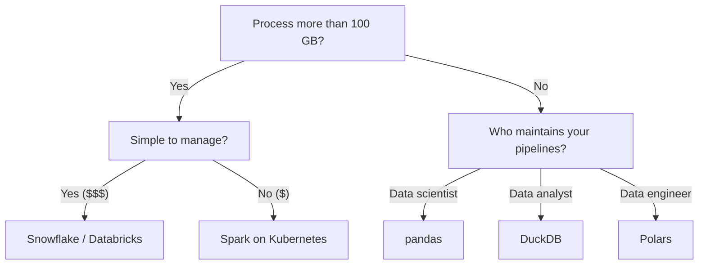
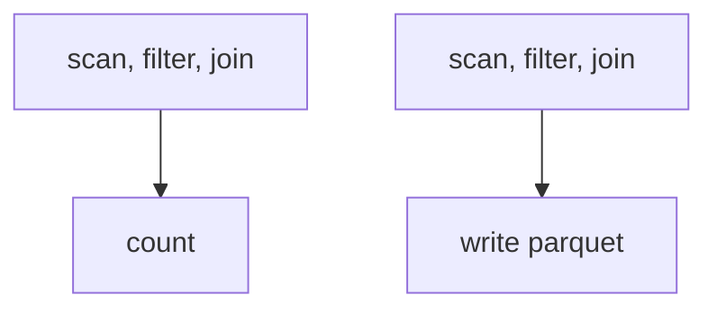
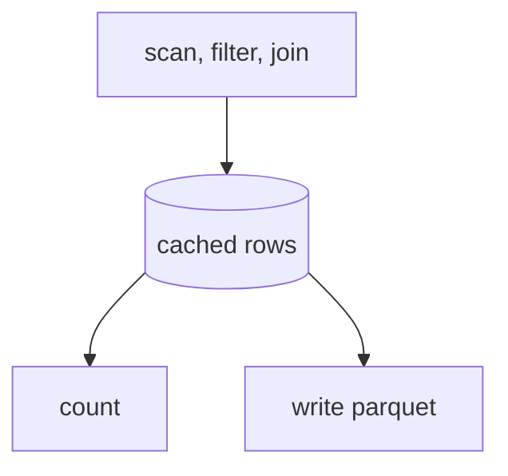

# DataFrame of <span class="dm-accent">Mind</span>

---
layout: agenda
label: Contents
---

# Contents

1. Data and schemas
2. The engines: pandas, DuckDB, Polars
3. Expressing a query
4. How the engine executes it
5. Choosing an engine
6. PySpark

---
layout: section
---

# Data and <span class="dm-accent">schemas</span>

---
layout: default
label: 1 · Data and schemas
---

# Operational vs. <span class="dm-accent">Analytical</span> Data

<div class="ova">
<div class="ova-side">

<div class="ova-pill ova-pill--navy">Operational ⚡</div>

- Detailed events
- Fast and complete (ACID)
- Reads and writes **one record**, all of its fields

</div>

<div class="ova-bits">
  
  <div class="ova-row" v-click="1" />
  <div class="ova-col" v-click="2" />
  <svg class="ova-loop" viewBox="0 0 340 340" v-click="3">
    <path d="M 120.4 33.7 A 145 145 0 1 0 214 36"
          fill="none" stroke="var(--dm-connecting)" stroke-width="12" />
    <polygon points="0,-13 26,0 0,13" transform="translate(219.6, 33.7) rotate(200)"
             fill="var(--dm-connecting)" />
  </svg>
</div>

<div class="ova-side">

<div class="ova-pill ova-pill--violet">Analytical 🔍</div>

- Descriptive and predictive
- Slow and selective
- Reads **one field** across every record

</div>
</div>

<p class="ova-caption" v-click="3">Operations capture reality event by event, analytics finds the
patterns, and the patterns change how the next event is served.</p>

<!--
It is all the same bits in the end, ones and zeros. What differs is the shape of the access. An
operational system grabs a whole record: this customer, this order, right now. An analytical system
grabs one field over millions of records: every order value of the past year. That single difference
drives everything downstream, from the file format to the engine.

Third click: during operations we capture the richness of reality, details of every event, so the
business keeps running and customers are served well. Afterwards we understand the patterns hidden
in the chaos, and leverage them to serve customers better, which keeps the business alive.
-->

---
layout: statement
title: Exercise - operational vs analytical data
---

# Exercise time: operational vs. analytical data

<p class="mt-6 text-lg opacity-80"><code>1-operational-vs-analytic/</code></p>

---
layout: default
label: 1 · Data and schemas
---

# Data is valuable when it has <span class="dm-accent">structure</span>

<div class="schema">
  <div class="schema-side" v-click="1">
    
    <div>⚡ faster writes<br />💰 resource-intensive (storage, processing)</div>
    
  </div>

  

  <div class="schema-side" v-click="1">
    
    <div>🐢 slower writes<br />🪶 resource-efficient</div>
    
  </div>
</div>

<p class="schema-punch" v-click="2">It's not a question of <span class="dm-accent">whether</span>
you apply a schema, it's a question of <span class="dm-accent">when</span>.</p>

<!--
Relational vs. schemaless databases. Both apply a schema. The question is who pays for it and when:
the writer, once, or every single reader, every single time.
-->

---
layout: default
label: 1 · Data and schemas
---

# A dataset with a schema is usually a <span class="dm-accent">DataFrame</span>

<div class="flex justify-center mt-6">
  
</div>

---
layout: default
label: 1 · Data and schemas
---

# Extracting and loading data: a wide range of <span class="dm-accent">possibilities</span>

<DmColumns class="mt-8">
<DmColumn header="Operational ⚡ (extract)" tone="navy">

- CSV / TSV
- Avro
- TXT
- RDBMS (Postgres, MySQL, SQLite, ...)

<div class="fmt-logos">
  
  
  
  
</div>

</DmColumn>
<DmColumn header="Analytical 🔍 (load)" tone="violet" divider>

- Parquet (Delta, Iceberg)
- ORC
- Feather / Arrow IPC
- DuckDB file format

<div class="fmt-logos">
  
  
  
  
</div>

</DmColumn>
</DmColumns>

---
layout: section
---

# Bring in the <span class="dm-accent">Animals</span> 🐼 🦆 🐻‍❄️

---
layout: default
label: 2 · The engines
---

# Query engines power the <span class="dm-accent">transformations</span> in ETL

<div class="flex justify-center mt-2">
  
</div>

<p class="text-center mt-2 opacity-80">Extract from many sources, transform in the engine, load into analytical storage.</p>

---
layout: default
label: 2 · The engines
---

# pandas, DuckDB and Polars <span class="dm-accent">compared</span>

<div class="dm-table mt-10">

|                | 🐼 pandas           | 🦆 DuckDB       | 🐻‍❄️ Polars         |
| -------------- | ------------------- | --------------- | ------------------ |
| Born 🐣        | 2008 🇺🇸             | 2019 🇳🇱          | 2020 🇳🇱             |
| Written in 📝  | Python (C, Fortran) | C++             | Rust               |
| GitHub stars ⭐ | 47.8K               | 35.8K           | 37.3K              |
| Loved by ❤️     | Data scientists 👩‍🔬  | Data analysts 👨‍💼 | Data engineers 👷   |

</div>

<style>
.dm-table table { width: 100%; border-collapse: collapse; font-size: 18px; }
.dm-table th { text-align: left; font-weight: 700; padding: 12px 16px; border-bottom: 1px solid var(--dm-connecting); }
.dm-table td { padding: 12px 16px; border-bottom: 1px solid rgba(8, 6, 53, 0.12); }
.dm-table tbody tr td:first-child { font-weight: 600; }
</style>

---
layout: default
label: 2 · The engines
---

# Polars is a side project that got <span class="dm-accent">out of hand</span> 🤷‍♂️

<DmColumns class="mt-6">
<DmColumn>

- Main author: Ritchie Vink 🇳🇱, structural engineer by education
- Started development during the COVID-19 pandemic 😷
- Full-time on Polars since July 2023, when he founded Polars Inc. to fund the work
- The company sells enterprise support and Polars Cloud
- One of the fastest growing data manipulation tools in the Python ecosystem

</DmColumn>
<DmColumn divider>

<div class="flex justify-center">
  
</div>

</DmColumn>
</DmColumns>

---
layout: statement
title: Demo - reading a dirty csv
---

# Demo time: a dirty, dirty CSV

<p class="mt-6 text-lg opacity-80"><code>demo-reading-data/</code> and <code>2-csv-from-hell/</code></p>

---
layout: section
---

# Querying and <span class="dm-accent">Transforming</span> Data

---
layout: default
label: 3 · Expressing a query
---

# Imperative, declarative and <span class="dm-accent">functional</span> styles

<DmColumns class="mt-4" :gap="16">
<DmColumn header="Imperative" tone="navy">

```py
affordable_cars = []
for car in cars:
  if car.price <= 30_000:
    affordable_cars.append(car)
```

Step by step, like a recipe.

</DmColumn>
<DmColumn header="Declarative" tone="navy" divider>

```sql
SELECT brand, price FROM cars
WHERE price <= 30000
```

Describe what you want, let an optimised engine work out how.

</DmColumn>
<DmColumn header="Functional" tone="violet" divider>

```py
cars = pl.read_csv("cars.csv")
affordable = cars.filter(
  pl.col("price") <= 30_000
)
```

Chain functions into a pipeline, no duplication, no mutation.

</DmColumn>
</DmColumns>

<!--
Exercise: split into three groups, write the same transformation logic in each style, compare the
results and discuss readability.
-->

---
layout: default
label: 3 · Expressing a query
---

# Relational algebra, the cornerstone of <span class="dm-accent">RDBMS</span>

<div class="flex justify-center mt-6">
  
</div>

<p class="text-center mt-4 opacity-80">Projection, selection, rename, set operations and the whole family of joins.</p>

<!--
Voilà, summarised in a single slide.
-->

---
layout: default
label: 3 · Expressing a query
---

# Project, filter, rename, union, <span class="dm-accent">join</span>

<DmColumns class="mt-4">
<DmColumn header="SQL" tone="navy">

```sql
SELECT
    price as car_price
FROM
    (
        SELECT * FROM old_cars
        UNION
        SELECT * FROM new_cars
    )
WHERE car_price > 30000
```

</DmColumn>
<DmColumn header="Polars" tone="violet" divider>

```py
import polars as pl

df = (
  pl.concat(
    pl.read_csv("old_cars.csv"),
    pl.read_csv("new_cars.csv"),
  )
  .select(
    pl.col("price").alias("car_price")
  )
  .filter(pl.col("car_price") > 30_000)
)
```

</DmColumn>
</DmColumns>

---
layout: default
label: 3 · Expressing a query
---

# To SQL or not to <span class="dm-accent">SQL</span>?

<DmColumns class="mt-4">
<DmColumn header="SQL wins on" tone="navy">

- Readability
- Getting stuff done
- Easy to learn, everyone speaks it


</DmColumn>
<DmColumn header="A DataFrame API wins on" tone="violet" divider>

- Abstraction (functions, modules)
- Control flow (if, for, while)
- Testing
- Ecosystem (linting, typing, packaging)

</DmColumn>
</DmColumns>

<div class="flex justify-center mt-2">
  
</div>

<!--
A discussion about the advantages and disadvantages of SQL vs. the DataFrame API.

Advantages: readable, lingua franca, powerful.
Disadvantages: higher level abstractions are missing, not general purpose, limited support for
software engineering practices (testing, version control, linting), which is what dbt tries to fix.

In the case of Polars: there is a SQLContext, but it lags the development of the DataFrame API a
bit. Stability should improve.
-->

---
layout: default
label: 3 · Expressing a query
---

# Beyond relational algebra: contexts and <span class="dm-accent">expressions</span>

Polars adds its own DSL on top of the relational engine. An **expression** is a tree of operations
describing how to build one or more Series. Expressions are always evaluated inside a **context**:
`select`, `with_columns`, `filter` and `group_by`.

```py {all|8-9|10-11|12-13}
df = pl.DataFrame({
    "integer": [1, 2, 3],
    "date": [datetime(2024, 1, 1), datetime(2024, 1, 2), datetime(2024, 1, 3)],
    "float": [4.0, 5.0, 6.0],
    "text": ["a", "b", "c"],
})

query = df.with_columns(                                    # context
    (pl.col("float") * pl.col("integer")).alias("int*float")  # expression
).filter(                                                   # context
    pl.col("date") >= datetime(2024, 1, 2)                    # expression
).select(                                                   # context
    pl.all()                                                  # expression
)
```

---
layout: default
label: 3 · Expressing a query
---

# Polars comes with a big bag of <span class="dm-accent">batteries</span> included

<DmColumns class="mt-4" :gap="16">
<DmColumn header="Column selectors" tone="navy">

```py
from polars import selectors as cs

df.select(cs.contains("a"))
df.select(cs.numeric())
```

Meta-queries over the schema, instead of hard-coded column lists.

</DmColumn>
<DmColumn header="Type namespaces" tone="navy" divider>

```py
df.with_columns(
  pl.col("baz").str.to_uppercase()
)
df.with_columns(
  pl.col("ts").dt.year()
)
```

Type-specific functions live in `.str`, `.dt`, `.list` and `.struct`.

</DmColumn>
<DmColumn header="Testing helpers" tone="violet" divider>

```py
from polars.testing import (
  assert_frame_equal)

assert_frame_equal(df1, df2)
# AssertionError: columns
# ['foo', 'bar', 'baz'] in left
# DataFrame, but not in right
```

Frame and series comparisons that fail with a readable message.

</DmColumn>
</DmColumns>

---
layout: statement
title: Exercise - relational algebra
---

# Exercise time: relational algebra

<p class="mt-6 text-lg opacity-80"><code>3-basic-transforms/</code></p>

---
layout: default
label: 3 · Expressing a query
---

# Windowing and <span class="dm-accent">aggregations</span>

<DmColumns class="mt-4">
<DmColumn header="Window: one row in, one row out" tone="navy">

```py
import polars as pl

df = (
  pl.read_csv("cars.csv")
  .with_columns(
    pl.col("price")
    .min()
    .over("model_type")
    .alias("price_without_options"),
  )
)
```

Calculate a value over a group and add it to every record of that group.

</DmColumn>
<DmColumn header="Aggregation: one group, one row" tone="violet" divider>

```py
import polars as pl

df = (
  pl.read_csv("cars.csv")
  .group_by("model_type")
  .agg(
    pl.col("price")
    .min()
    .alias("price_without_options"),
  )
)
```

Calculate a value over a group and return one record per group.

</DmColumn>
</DmColumns>

---
layout: statement
title: Exercise - windowing and aggregations
---

# Exercise time: windowing and aggregations

<p class="mt-6 text-lg opacity-80"><code>4-window-aggregations/</code></p>

---
layout: default
label: 3 · Expressing a query
---

# The standard <span class="dm-accent">join types</span>

<div class="flex justify-center mt-2">
  
</div>

---
layout: default
label: 3 · Expressing a query
---

# Polars supports all <span class="dm-accent">standard</span> join operations

```py
DataFrame.join(
    other: DataFrame,
    on: str | Expr | Sequence[str | Expr] | None = None,
    how: JoinStrategy = 'inner',
    *,
    left_on: str | Expr | Sequence[str | Expr] | None = None,
    right_on: str | Expr | Sequence[str | Expr] | None = None,
    suffix: str = '_right',
    validate: JoinValidation = 'm:m',
    join_nulls: bool = False,
    coalesce: bool | None = None,
) -> DataFrame
```

`validate` is worth remembering: it turns a silent row explosion into an error.

---
layout: default
label: 3 · Expressing a query
---

# ... and even <span class="dm-accent">non-standard</span> joins

```py
DataFrame.join_asof(
    other: DataFrame,
    left_on: str | None | Expr = None,
    right_on: str | None | Expr = None,
    on: str | None | Expr = None,
    by_left: str | Sequence[str] | None = None,
    by_right: str | Sequence[str] | None = None,
    by: str | Sequence[str] | None = None,
    strategy: AsofJoinStrategy = 'backward',
    suffix: str = '_right',
    tolerance: str | int | float | timedelta | None = None,
    allow_parallel: bool = True,
    force_parallel: bool = False,
) -> DataFrame
```

Match on the nearest key rather than an exact one. Useful for time series: sensor readings joined
to the most recent configuration change.

---
layout: statement
title: Exercise - joins
---

# Exercise time: joins

<p class="mt-6 text-lg opacity-80"><code>5-joins/</code></p>

---
layout: section
---

# How the engine <span class="dm-accent">executes</span> it

---
layout: default
label: 4 · How the engine executes it
---

# Lazy vs. <span class="dm-accent">eager</span> evaluation

<DmColumns class="mt-2">
<DmColumn header="Eager: read_csv" tone="navy">


Every step runs the moment you write it. Fine for exploration, wasteful for pipelines.

</DmColumn>
<DmColumn header="Lazy: scan_csv" tone="violet" divider>


Nothing runs until `.collect()`. The optimiser sees the whole query and rewrites it.

</DmColumn>
</DmColumns>

---
layout: default
label: 4 · How the engine executes it
---

# Some optimisations: <span class="dm-accent">pushdown</span>

<DmColumns class="mt-4">
<DmColumn>

- **Predicate pushdown**: filter rows as early as possible
- **Projection pushdown**: drop columns as early as possible
- **Query pushdown**: push filters, joins and aggregations into the data source

Typically applied while reading the data, so the rows never enter memory at all.

</DmColumn>
<DmColumn divider>

<div class="flex justify-center">
  
</div>

</DmColumn>
</DmColumns>

---
layout: default
label: 4 · How the engine executes it
---

# Some optimisations: join <span class="dm-accent">reordering</span>

<div class="flex justify-center mt-2">
  
</div>

<p class="text-center mt-2 opacity-80">Same three inputs, same result, 6 million intermediate rows of difference.</p>

---
layout: default
label: 4 · How the engine executes it
---

# Polars streaming: when you are <span class="dm-accent">resource-constrained</span>

Instead of processing the data all at once, Polars can execute the query in batches, which lets you
process datasets larger than memory.

<DmColumns class="mt-4">
<DmColumn>

```py
q1 = (
    pl.scan_csv("car.csv")
    .filter(pl.col("price") < 30_000)
    .group_by("brand")
    .agg(pl.col("max_speed").max())
)
df = q1.collect(streaming=True)
```

</DmColumn>
<DmColumn header="Supported operations" tone="navy" divider>

`filter`, `slice`, `head`, `tail`, `with_columns`, `select`, `group_by`, `join`, `unique`, `sort`,
`explode`, `melt`, `scan_csv`, `scan_parquet`, `scan_ipc`

</DmColumn>
</DmColumns>

---
layout: default
label: 4 · How the engine executes it
---

# A bit <span class="dm-accent">unread</span> is a bit less to process

<div class="flex justify-center mt-2">
  
</div>

<p class="mt-4">Pushdown is the engine skipping bytes for you. It can only skip what the layout
allows, so partition along the column you filter on first.</p>

<!--
Interactive discussion: suppose you have a large collection of parquet files, but are only
interested in a subset of the data (e.g. year = 2019). How do you query the data efficiently?
-->

---
layout: statement
title: Demo - hive partitioning
---

# Demo: hive-partitioned vs. plain Parquet

---
layout: default
label: 4 · How the engine executes it
---

# When SQL doesn't cut it: user defined <span class="dm-accent">functions</span>

<DmColumns class="mt-4" :gap="16">
<DmColumn header="map_rows" tone="navy">

```py
df.map_rows(
  lambda t: (t[0] * 2, t[1] * 3)
)
```

Every row as a tuple. Column names are lost, and it is the slowest of the three.

</DmColumn>
<DmColumn header="map_batches" tone="navy" divider>

```py
pl.col("features").map_batches(
  lambda s: model.forward(
    s.to_numpy())
)
```

The whole Series at once, so NumPy and PyTorch run once per column.

</DmColumn>
<DmColumn header="map_elements" tone="violet" divider>

```py
pl.col("a").map_elements(
  lambda x: x * 2,
  return_dtype=pl.Int64,
)
```

One value at a time. Pass `return_dtype` or Polars infers it from the first result.

</DmColumn>
</DmColumns>

<p style="margin-top: 32px;">Every UDF drops out of the optimised engine and back into the Python
interpreter, so check for a builtin first.</p>

---
layout: statement
title: Exercise - user defined functions
---

# Exercise time: UDFs

<p class="mt-6 text-lg opacity-80"><code>6-udf/</code></p>

---
layout: section
---

# Big <span class="dm-accent">Data</span>?

---
layout: default
label: 5 · Choosing an engine
---

# The data processing landscape over the <span class="dm-accent">years</span>

<EraTimeline />

<div class="mt-12">

- 📈 First wave optimised for **scale**: commodity machines, open source, structured and
  semi-structured data

<v-clicks>

- 💆 Second wave optimised for **simplicity**: managed platforms hid the cluster
- 💰 Third wave optimised for **cost**: Kubernetes brought the cluster back, cheaper

</v-clicks>

</div>

<!--
The promise of Spark and distributed processing was: scaling out cheaply on commodity machines,
relying on open source so you are not locked in to a vendor, and supporting both structured and
semi-structured data. The downside was that distributed processing was difficult.

The bottleneck then shifted towards maintaining the cluster of machines. Companies struggled with
managing them, which is why the second evolution introduced managed systems that abstract away the
complexity: Snowflake and Databricks. In 2018, Spark answered these private companies by leveraging
Kubernetes.

If we plot these three characteristics as the corners of a triangle...
-->

---
layout: default
label: 5 · Choosing an engine
---

# Emerging single node processing <span class="dm-accent">technologies</span>

<TradeoffTriangle />

<!--
Separation of compute and storage allowed for effective scalability. The main evolution over the
past years was to simplify this complex cluster of machines, which resulted in expensive systems
(Snowflake, Databricks). The alternative was doing everything yourself, which takes time and
requires a strong team.

On the click: not all pipelines need to scale to terabytes. Single machine specs in the cloud have
improved a lot, which created room for Polars and DuckDB. Pandas has been around since 2008.
-->

---
layout: default
label: 5 · Choosing an engine
---

# Interest in big data, and what one machine <span class="dm-accent">now holds</span>

<DmColumns class="mt-4">
<DmColumn header="Interest in 'big data' is past its peak" tone="navy">


</DmColumn>
<DmColumn header="One machine now holds 12 TB of RAM" tone="violet" divider>


</DmColumn>
</DmColumns>

---
layout: default
label: 5 · Choosing an engine
---

# You can't please all of the people all the time, luckily there is an <span class="dm-accent">escape hatch</span>

<ArrowHub />

<!--
TODO in the original: rework the arrow image to use other technologies and formats.

Arrow is the columnar memory format that Spark, pandas, Polars and DuckDB all speak, and it reads
from the same files and object stores they do. Handing a DataFrame from one engine to another costs
no serialisation, so the choice of engine can be made per step instead of per project. That is the
escape hatch: you are not locked into the engine you started with.
-->

---
layout: default
label: 5 · Choosing an engine
---

# When do I use <span class="dm-accent">what</span>?



---
layout: section
---

# Apache <span class="dm-accent">Spark</span>

---
layout: default
label: 6 · PySpark
---

# The same query in <span class="dm-accent">PySpark and Polars</span>

<DmColumns class="mt-4">
<DmColumn header="PySpark" tone="navy">

```py
from pyspark.sql import SparkSession
from pyspark.sql.window import Window
import pyspark.sql.functions as sf

spark = SparkSession.builder.getOrCreate()

df = (
  spark.read.csv("measurements.csv")
  .withColumn("year", sf.year("timestamp"))
  .withColumn("max_weight_per_year",
              sf.max("weight")
              .over(Window.partitionBy("year"))
              )
)

df.collect()
```

</DmColumn>
<DmColumn header="Polars" tone="violet" divider>

```py
import polars as pl

df = (
  pl.scan_csv("measurements.csv")
  .with_columns(
    pl.col("timestamp").dt.year()
    .alias("year")
  )
  .with_columns(
    pl.col("weight").max().over("year")
    .alias("max_weight_per_year")
  )
)

df.collect()
```

</DmColumn>
</DmColumns>

<p class="mt-4">Both express the same operations, and both are lazy. The rest of this section covers
what changes when the work runs on a cluster instead of in one process.</p>

---
layout: default
label: 6 · PySpark
---

# Large jobs are limited by <span class="dm-accent">I/O</span>, and a cluster adds bandwidth

<DmColumns class="mt-4">
<DmColumn>

<DmColumn header="One machine" tone="navy">

- One network card, one set of disks: a few GB/s at best
- 10 TB at 1 GB/s: three hours before any computation starts
- The CPUs idle, waiting for bytes

</DmColumn>

<DmColumn header="A cluster" tone="violet" class="mt-5">

- Every executor reads its own slice, so bandwidth grows with the machine count
- 10 TB across 60 executors: minutes, if the object store keeps up
- Memory scales the same way

</DmColumn>

</DmColumn>
<DmColumn divider>

<div class="flex justify-center">
  
</div>

</DmColumn>
</DmColumns>

<!--
Easy to miss: distributing is not mainly about CPU, it is about I/O. A single machine is capped by
its network card and its disks, and on a large scan the processors are idle most of the time,
waiting for bytes. The Goliath on the left is that machine: an impressive engine with one entrance,
and everyone queues at it. Making the locomotive bigger does not shorten the queue.

Add machines and the aggregate read bandwidth grows with them, which is why a cluster finishes a
10 TB scan in minutes rather than hours. That is the city line on the right: three cars, every car
with its own door, passengers boarding in parallel. The numbers are round arithmetic, not a
benchmark: 1 GB/s per machine, 10 TB, 60 executors.

The doors only help if the platform can feed them, which is the object store caveat, and the same
reason a badly partitioned dataset leaves executors idle.

It also explains why the first half mattered: columnar formats and partitioning shrink the bytes you
read in the first place, and that helps on one machine and on sixty.
-->

---
layout: default
label: 6 · PySpark
---

# A submitted job runs on a <span class="dm-accent">driver and its executors</span>

Scaling out means adding machines rather than buying a bigger one. This is the machinery that makes
that possible.

<DmColumns class="mt-3">
<DmColumn>


Your program runs in the driver. The cluster manager allocates executors on worker nodes, and the
driver ships the code and the tasks to them.

</DmColumn>
<DmColumn divider>

```bash
$ ./bin/spark-submit \
    --master k8s://https://<host>:<port> \
    --deploy-mode cluster \
    --name spark-pi \
    --conf spark.executor.instances=5 \
    --conf spark.kubernetes.container.image=<image> \
    local:///path/to/examples.jar
```

`spark-submit` sets `SPARK_HOME` and `JAVA_HOME` and hands your program to the launcher.

Note the arrow between the workers: executors talk to each other, not only to the driver. The next
slide is about that arrow.

</DmColumn>
</DmColumns>

<!--
1. To start a Spark application, you submit it. spark-submit comes bundled with the Spark binary and
   is a short script that sets environment variables, looks for a Java installation and passes
   options to the launcher, written in Java.
2. Your program starts a SparkContext, in the driver process. It connects to a cluster manager and
   asks for computing resources.
3. The cluster manager allocates them to executor processes on the worker nodes.
4. Spark sends the application code and its dependencies to the executors, then sends tasks.

The cluster manager keeps checking the workers are alive and the driver listens for new worker
announcements, which is where resiliency comes from.
-->

---
layout: default
label: 6 · PySpark
---

# Wide transformations <span class="dm-accent">shuffle</span> data across the network

<DmColumns class="mt-3">
<DmColumn header="Narrow: no data moves" tone="navy">

`select`, `filter`, `withColumn`, `union`

Each executor works on the partitions it already holds. Spark chains these into one stage.

</DmColumn>
<DmColumn header="Wide: rows meet on one executor" tone="violet" divider>

`groupBy`, `join`, `distinct`, `sort`, `repartition`

All rows with the same key have to end up in the same place, so Spark writes shuffle files and moves
them over the network. That ends a stage and starts the next.

</DmColumn>
</DmColumns>

```py
df.filter(sf.col("age") > 18).groupBy("country").count().explain()
# AdaptiveSparkPlan isFinalPlan=false                        (abridged)
# +- HashAggregate(keys=[country], functions=[count(1)])
#    +- Exchange hashpartitioning(country, 200)     <- the shuffle
#       +- HashAggregate(keys=[country], [partial_count(1)])
#          +- Filter (age > 18)
```

<p class="mt-2">No Polars equivalent: in one process a <code>group_by</code> is a hash table, not a
network transfer.</p>

---
layout: default
label: 6 · PySpark
---

# <span class="dm-accent">Partition count</span> decides how much of the cluster stays busy

<DmColumns class="mt-2" :gap="16">
<DmColumn header="72 vCPUs, idle at the tail" tone="navy">


</DmColumn>
<DmColumn header="Partitions matched to cores" tone="violet" divider>


</DmColumn>
</DmColumns>

<p class="mt-3">The 200 in that <code>Exchange</code> is the default of
<code>spark.sql.shuffle.partitions</code>, applied to every shuffle whatever your data or cluster
size. Make it a multiple of the cluster cores. Since Spark 3.2 adaptive execution coalesces them at
runtime, so treat 200 as a starting point.</p>

<!--
A cluster of 72 CPUs over 9 nodes. On the partition distribution (top left) the workers process
partitions in parallel, but near the end some CPUs start idling: the load drops to about 25% for
roughly 5 minutes. Wasting 75% of a 72 vCPU cluster for 5 minutes is costly.

The fix is to make the partition count a multiple of the vCPU count, which is what was done on the
right. The blocks are smaller because there are more partitions, the total work is the same. Memory
usage was only 50%, so memory could be halved and the CPU count doubled for the same price.
-->

---
layout: default
label: 6 · PySpark
---

# Transformations are <span class="dm-accent">lazy</span>, actions trigger execution

<DmColumns class="mt-4">
<DmColumn>

```py
import pyspark.sql.functions as sf

df1 = spark.range(3)
df2 = df1.withColumn("foo", sf.lit("bar"))
df3 = df2.withColumn("bar", sf.col("id") < 2)
df4 = df3.filter(sf.col("id") != 1)
df5 = df4.select("foo", "bar", "id",
                 (sf.col("id") + 2).alias("plus2"))
df6 = df5.drop("id")
df7 = df6.withColumnRenamed("bar", "lessthan2")

df7.printSchema()   # free: bookkeeping only
print(df7.count())  # action: the plan runs
df7.show()          # action
```

</DmColumn>
<DmColumn divider>

Polars taught you this with `scan_csv` and `collect`. Spark works the same way: transformations
build a plan, actions run it.

Two things are different once the plan runs on a cluster:

- ⚠️ Errors surface at the **action**, not at the line that caused them, and they arrive as a Java
  stack trace from an executor.
- `DataFrame.explain()` shows the physical plan, including every `Exchange`.

</DmColumn>
</DmColumns>

---
layout: default
label: 6 · PySpark
---

# Chaining drops the intermediate names, <span class="dm-accent">transform</span> makes steps testable

<DmColumns class="mt-3" :gap="16">
<DmColumn header="Chain the calls" tone="navy">

```py
df = (
    spark.range(3)
    .withColumn("foo", sf.lit("bar"))
    .withColumn("bar", sf.col("id") < 2)
    .filter(sf.col("id") != 1)
    .select("foo", "bar", "id",
            (sf.col("id") + 2).alias("plus2"))
    .drop("id")
    .withColumnRenamed("bar", "lessthan2")
)
```

No `df1` to `df7` to keep straight, and no filtering `df3` when you meant `df4`.

</DmColumn>
<DmColumn header="Name the steps with transform" tone="violet" divider>

```py
def add_flags(df: DataFrame) -> DataFrame:
    return (df
        .withColumn("foo", sf.lit("bar"))
        .withColumn("bar", sf.col("id") < 2))

def drop_middle(df: DataFrame) -> DataFrame:
    return df.filter(sf.col("id") != 1)

df = (spark.range(3)
      .transform(add_flags)
      .transform(drop_middle))
```

A `DataFrame -> DataFrame` function is testable on three rows, no cluster involved.
`transform` is PySpark's pipe; Polars spells it `.pipe()`.

</DmColumn>
</DmColumns>

<!--
The reassignment style on the previous slide is what most PySpark code in the wild looks like. It
reads top to bottom, but every intermediate name is a chance to reference the wrong one, and none of
the steps can be tested on its own.

Chaining fixes the naming. transform fixes the testing: the moment a step is a named function taking
a DataFrame and returning a DataFrame, it can be unit tested with a handful of rows, and the same
function works in a pipeline of any size.
-->

---
layout: default
label: 6 · PySpark
---

# A DataFrame used twice is computed twice, unless you <span class="dm-accent">cache</span> it

<DmColumns class="mt-2" :gap="16">
<DmColumn header="Two actions, two full recomputations" tone="navy">



</DmColumn>
<DmColumn header="Cached: computed once, read twice" tone="violet" divider>



</DmColumn>
</DmColumns>

```py
enriched = (spark.read.parquet("events")
            .filter(sf.col("year") == 2024)
            .join(dim_user, "user_id")
            .cache())          # lazy too: the first action fills it
enriched.count()               # computes, then keeps the rows
enriched.write.parquet("out")  # reads the cache instead
```

<p class="mt-3">Only worth it when one DataFrame feeds more than one action. Call
<code>unpersist()</code> when the branch is done.</p>

<!--
A Spark plan is lineage, not a result. Every action walks the plan back to the source, so a
DataFrame used by two actions is computed twice, all the way from the files.

cache() marks it to be kept after the first action computes it. persist() is the same thing with a
storage level you choose. Neither computes anything on its own.

The default storage level for a DataFrame is MEMORY_AND_DISK, so a cached frame that does not fit
in memory spills, and you pay for both the memory pressure and the disk read.

Ask the room: where would you put a cache in a pipeline that writes three reports from one joined
dataset? And what happens if the cached frame is bigger than the executor memory?
-->

---
layout: default
label: 6 · PySpark
---

# A UDF runs Python per row, <span class="dm-accent">outside</span> Spark's optimiser

<DmColumns class="mt-4">
<DmColumn>

```py
import pyspark.sql.functions as sf
from pyspark.sql.types import IntegerType

def square(x):
    return x**2

square_as_udf = sf.udf(
    square, returnType=IntegerType())
df.withColumn("squared", square_as_udf("id"))
```

You must declare the return type: the optimiser cannot infer it from Python.

</DmColumn>
<DmColumn divider>

In Polars a UDF drops from Rust into Python in the same process. In Spark, every row is serialised
out of the JVM into a separate Python worker and back again.

That round trip is why `pandas_udf` exists: it hands the worker an Arrow batch instead of a row, so
the crossing happens once per batch.

The rule from the Polars half still holds, only more so: look for a builtin first.

</DmColumn>
</DmColumns>

<!--
Higher order functions are a feature people know from functional programming. udf takes a function
and returns a new function.
-->

---
layout: default
label: 6 · PySpark
---

# One core, four libraries: <span class="dm-accent">SQL, streaming, MLlib, GraphX</span>

<div class="flex justify-center mt-2 mb-4">
  
</div>

<DmProcess class="mt-4">
<DmPhase label="SQL" />
<DmPhase label="Streaming" />
<DmPhase label="MLlib" />
<DmPhase label="GraphX" />
</DmProcess>

<p style="margin-top: 28px;">All four sit on the Spark core, whose abstraction is the resilient
distributed dataset (RDD). The core also handles task dispatch, scheduling and I/O.</p>

<p class="mt-2">They share one API and one deployment, in Scala, Java, Python, R and SQL with almost
identical names. Training a model on a batch and then scoring a stream needs no second system.</p>

<!--
Spark offers SQL-like queries against massive datasets. Streaming processes data as it arrives, like
sensor readings from an IoT device. MLlib covers machine learning. GraphX handles graph-like data
where relations matter.

Even though Spark is written in Scala, it has bindings in 5 officially supported languages. Whatever
you learn in one language is named identically in the others, R excepted.
-->

---
layout: default
label: 6 · PySpark
---

# Batch and streaming share the <span class="dm-accent">same transformations</span>

<DmColumns class="mt-4">
<DmColumn header="Batch: aggregate a database table" tone="navy">

```py
df = (spark
  .read
  .format("jdbc")
  .option("url", url)
  .option("dbtable", "people")
  .load()
  )

counts_by_age = df.groupBy("age").count()
```

</DmColumn>
<DmColumn header="Streaming: count words as they arrive" tone="violet" divider>

```py
lines = (spark
  .readStream
  .format("socket")
  .option("host", host)
  .option("port", port)
  .load()
  )

words = lines.select(
    explode(split(lines.value, " ")).alias("word"))
word_counts = words.groupBy("word").count()

query = (word_counts.writeStream
         .format("console").start())
```

</DmColumn>
</DmColumns>

<p class="mt-4">Swap <code>read</code> for <code>readStream</code> and the business logic is
identical: <code>select</code>, <code>groupBy</code>, <code>count</code>.</p>

<!--
There are not many databases that can do streaming like this. Note the similarities: select,
groupBy, count. The transformations are identical between the batch and the streaming case.
-->

---
layout: default
label: 6 · PySpark
---

# SQL and the DataFrame API compile to the <span class="dm-accent">same plan</span>

Both go through the same optimiser and run on the same executors. Neither is faster, and neither is
"more distributed" than the other, so the choice is about maintaining the code.

<DmColumns class="mt-4">
<DmColumn header="Write it in SQL" tone="navy">

```py
with open("min_max_by_user.sql") as fh:
    query = fh.read()
spark.sql(query)
```

- Everyone on the team reads it
- Says what, not how
- No second API to learn

</DmColumn>
<DmColumn header="Write it in Python" tone="violet" divider>

- Functions and modules instead of copy and paste
- Branches and loops
- Unit tests on the transformation
- Type checking and linting before you deploy
- Machine learning in the same program

</DmColumn>
</DmColumns>

<p class="mt-3">Spark distributes the work either way, so scale is not the tiebreaker.</p>

<!--
The same argument as "To SQL or not to SQL?" in the first half, with one difference: there the
choice was also about what the engine could do, here both paths run on the same engine.

dbt counters some of these shortcomings with macros, but there is a richness to a general purpose
language, like specialised types, that a SQL layer does not have.
-->

---
layout: section
---

# Running it in <span class="dm-accent">practice</span>

---
layout: default
label: 6 · PySpark
---

# Polars ships as a <span class="dm-accent">wheel</span>; PySpark needs a <span class="dm-accent">JVM</span>

<DmColumns class="mt-4">
<DmColumn header="Polars" tone="navy">

```bash
uv add polars
```

- One wheel with a Rust binary inside
- No runtime to install, no services to start
- The same code runs in a notebook, a Lambda and a CI job

</DmColumn>
<DmColumn header="PySpark" tone="violet" divider>

```bash
uv add pyspark               # ~300 MB
apt install openjdk-17-jre   # + JAVA_HOME
```

```py
spark = (SparkSession.builder
    .master("local[*]")          # one machine
    .config("spark.sql.shuffle.partitions", 200)
    .getOrCreate())
```

- `local[*]` for your laptop, a cluster manager for anything else
- Settings live in `conf/spark-defaults.conf`, this repo ships one

</DmColumn>
</DmColumns>

<p class="mt-3">The cost of the second engine is the runtime around it: a JVM of the right version,
a cluster manager, and configuration.</p>

<!--
The JDK version really does matter: on this repo's own venv, Java 23 with PySpark 4.1 fails with
"UnsupportedOperationException: getSubject is supported only if a security manager is allowed".
Spark 4 wants Java 17 or 21.

Some platforms (Databricks, spark-shell, pyspark) create the SparkSession for you, which is
convenient but hides this. The number of config options is large because Spark integrates with YARN,
Mesos and Kubernetes and manages a JVM on every worker. The defaults are usually well chosen.

local[*] runs Spark locally with as many worker threads as logical cores on your machine.
-->

---
layout: default
label: 6 · PySpark
---

# Connectors need matching <span class="dm-accent">JARs</span> and configuration

<DmColumns class="mt-4" :gap="16">
<DmColumn header="AWS S3 outside EMR" tone="navy">

```py
config = {
    "spark.jars.packages":
        "org.apache.hadoop:hadoop-aws:<version>",
    "spark.hadoop.fs.s3a.aws.credentials.provider":
        "org.apache.hadoop.fs.s3a"
        ".SimpleAWSCredentialsProvider",
}
conf = SparkConf().setAll(config.items())
spark = SparkSession.builder.config(
    conf=conf).getOrCreate()

df = spark.read.csv(f"s3a://{BUCKET}/{KEY}",
                    header=True)
```

</DmColumn>
<DmColumn header="Snowflake" tone="violet" divider>

```py
snowflake_pkgs = [
    "net.snowflake:snowflake-jdbc:<version>",
    "net.snowflake:spark-snowflake_2.12:<version>",
]
config = {
    "spark.jars.packages": ",".join(snowflake_pkgs),
}
conf = SparkConf().setAll(config.items())
spark = SparkSession.builder.config(
    conf=conf).getOrCreate()
```

</DmColumn>
</DmColumns>

<p class="mt-4">Versions have to line up: hadoop-aws against the Hadoop libraries in your Spark
install, spark-snowflake against your Spark version. Then come the authentication options. Polars
reads <code>s3://</code> with <code>pip install polars[aws]</code>.</p>

---
layout: default
label: 6 · PySpark
---

# Readers and writers handle formats, folders and <span class="dm-accent">partitioning</span>

<DmColumns class="mt-4">
<DmColumn>

```py
frame = spark.read.csv(
    str(csv_file_path), sep=";", header=True)

frame = (
    spark.read
    .options(header="true", sep=";", inferSchema=True)
    .format("csv")
    .load(str(csv_file_path))
)

frame.write.parquet(
    "some_location",
    mode="overwrite",
    partitionBy="country",
)
```

</DmColumn>
<DmColumn header="Hive-partitioned output" tone="navy" divider>

```text
├── date=2021-10-08
│   ├── train_id=200
│   │   ├── part-00000-6d…
│   │   └── part-00001-6d…
│   ├── train_id=231
│   │   ├── part-00000-6d…
│   │   └── part-00001-6d…
│   └── train_id=4361
│       ├── part-00000-6d…
│       └── part-00001-6d…
├── date=2021-10-09
│   ├── train_id=200
```

One file per partition per writer, in folders named after the column value. The same layout Polars
read from earlier: partition on what you filter on first.

</DmColumn>
</DmColumns>

<!--
The first method is pythonic: the file type is known in advance. The second is general purpose, with
options() and load(). Writing works the same way.

You can read a folder of nested files by supplying the top-level path, as long as they share a
schema: no CSVs and JSONs together.

Best practice: partition on the full date, not on year, month and day separately, which makes
filtering harder afterwards.
-->

---
layout: default
label: 6 · PySpark
---

# When to reach for <span class="dm-accent">Spark</span>

<DmColumns class="mt-6">
<DmColumn header="Spark earns its keep" tone="navy">

- The data does not fit one machine, and streaming it through does not help
- You already run a platform that hosts it: Databricks, EMR, Kubernetes
- You need batch, streaming and ML behind one API
- A job runs long enough that losing a node matters

</DmColumn>
<DmColumn header="Stay on one node" tone="violet" divider>

- It fits in memory, or streams through a single machine
- You want a fast local loop and a short install
- The team is small and the pipeline is simple
- Cost per query matters more than peak scale

</DmColumn>
</DmColumns>

<p class="mt-6">A cluster costs a JVM, configuration, shuffles and idle CPUs, whether or not the
data needs the scale. The decision tree from the first half still applies.</p>

---
layout: default
label: Recap
---

# What we <span class="dm-accent">covered</span>

<div class="dm-recap mt-6">

1. **Same data, different storage.** Operational and analytical systems hold the same facts. Storing
   them row by row or column by column is what decides which questions are cheap to ask.
2. **Let the engine do the heavy lifting.**
   - It turns what you asked for into a plan, then reorders joins and pushes filters and column
     selections down into the scan, so it reads less.
   - You help it by storing data columnar and partitioning along the questions you actually ask.
     It can only skip what the layout allows.
3. **Relational algebra has lasted.** Project, filter, join, aggregate, window. SQL and the DataFrame
   API are two ways of writing the same operations.
4. **One node goes a long way.** For most pipelines a single machine is simpler, cheaper and quicker
   to iterate on. Reach for Spark when the data is genuinely large.

</div>

---
layout: thanks
title: Thank you
---

# Thank you
