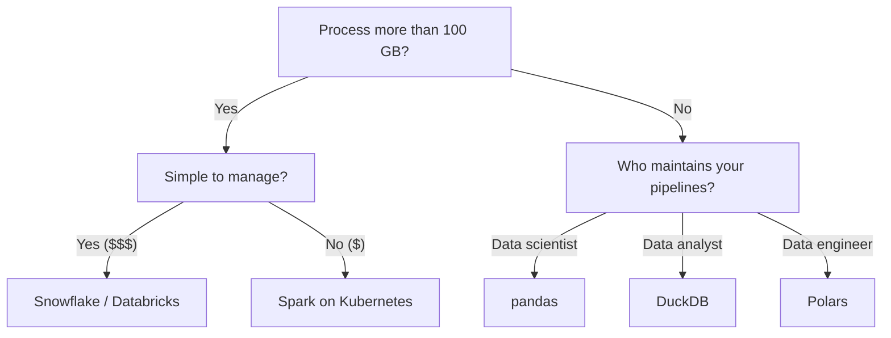
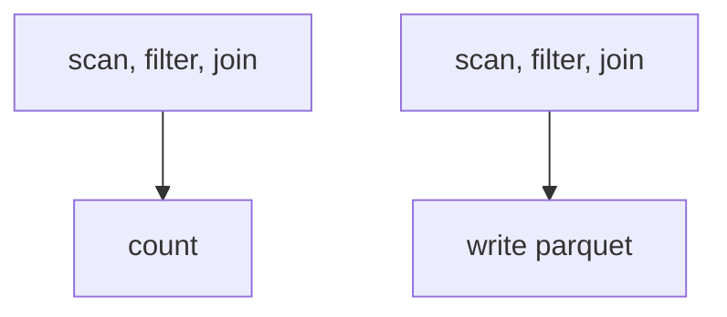
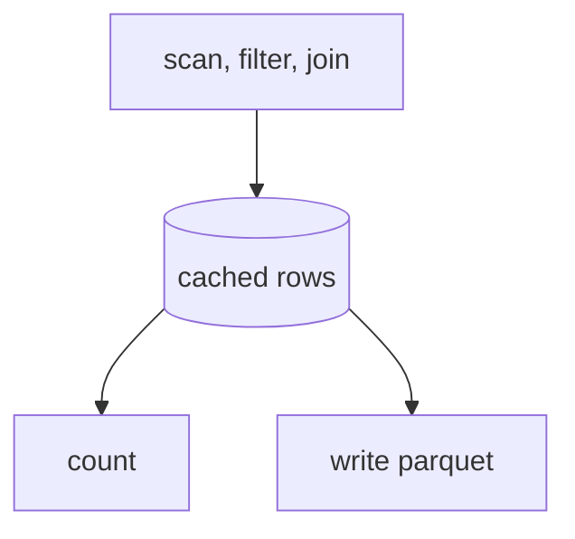

# DataFrame of <span class="dm-accent">Mind</span>

---
layout: agenda
label: Contents
---

# Contents

1. Data and schemas
2. The engines: pandas, DuckDB, Polars
3. Expressing a query
4. How the engine executes it
5. Choosing an engine
6. PySpark

---
layout: section
---

# Data and <span class="dm-accent">schemas</span>

---
layout: default
label: 1 · Data and schemas
---

# Operational vs. <span class="dm-accent">Analytical</span> Data

<div class="ova">
<div class="ova-side">

<div class="ova-pill ova-pill--navy">Operational ⚡</div>

- Detailed events
- Fast and complete (ACID)
- Reads and writes **one record**, all of its fields

</div>

<div class="ova-bits">
  
  <div class="ova-row" v-click="1" />
  <div class="ova-col" v-click="2" />
  <svg class="ova-loop" viewBox="0 0 340 340" v-click="3">
    <path d="M 120.4 33.7 A 145 145 0 1 0 214 36"
          fill="none" stroke="var(--dm-connecting)" stroke-width="12" />
    <polygon points="0,-13 26,0 0,13" transform="translate(219.6, 33.7) rotate(200)"
             fill="var(--dm-connecting)" />
  </svg>
</div>

<div class="ova-side">

<div class="ova-pill ova-pill--violet">Analytical 🔍</div>

- Descriptive and predictive
- Slow and selective
- Reads **one field** across every record

</div>
</div>

<p class="ova-caption" v-click="3">Operations capture reality event by event, analytics finds the
patterns, and the patterns change how the next event is served.</p>

<!--
It is all the same bits in the end, ones and zeros. What differs is the shape of the access. An
operational system grabs a whole record: this customer, this order, right now. An analytical system
grabs one field over millions of records: every order value of the past year. That single difference
drives everything downstream, from the file format to the engine.

Third click: during operations we capture the richness of reality, details of every event, so the
business keeps running and customers are served well. Afterwards we understand the patterns hidden
in the chaos, and leverage them to serve customers better, which keeps the business alive.
-->

---
layout: default
label: 1 · Data and schemas
---

# <span class="dm-accent">Rows</span> group records; <span class="dm-accent">columns</span> group fields

<div class="storage-compare">
  <div class="storage-format storage-format--rows">
    <div class="storage-format-head">
      <strong>Row-oriented</strong>
      <span>one line per record</span>
    </div>
    <div class="storage-file" aria-label="The same data stored one record per line">
      <div class="storage-line storage-line--header">id,name,weight_kg,age,heart_rate,country</div>
      <div class="storage-line">8,Ana,210,4,76,CA</div>
      <div class="storage-line">1042,Nanook,480,15,54,NO</div>
      <div class="storage-line">73,Pipaluk,320,9,68,GL</div>
      <div class="storage-line storage-record-run">615,Siku,405,12,61,CA</div>
      <div class="storage-line">204,Nuka,260,6,72,US</div>
      <div class="storage-line">981,Tala,505,18,52,RU</div>
    </div>
    <p class="storage-question">Give me record <b>615</b></p>
  </div>

  <div class="storage-divider"><span>same data</span></div>

  <div class="storage-format storage-format--columns">
    <div class="storage-format-head">
      <strong>Column-oriented</strong>
      <span>one line per field</span>
    </div>
    <div class="storage-file" aria-label="The same data stored one field per line">
      <div class="storage-line storage-line--header">field,value1,value2,value3,value4,value5,value6</div>
      <div class="storage-line">id,8,1042,73,615,204,981</div>
      <div class="storage-line">name,Ana,Nanook,Pipaluk,Siku,Nuka,Tala</div>
      <div class="storage-line">weight_kg,210,480,320,405,260,505</div>
      <div class="storage-line storage-field-run">age,4,15,9,12,6,18</div>
      <div class="storage-line">heart_rate,76,54,68,61,72,52</div>
      <div class="storage-line">country,CA,NO,GL,CA,US,RU</div>
    </div>
    <p class="storage-question">Give me the highest <b>age</b></p>
  </div>
</div>

<p class="storage-punch" v-click="2">Same values, different order on disk, different work to retrieve them.</p>

<!--
This is the same tiny dataset written in two different orders. In the row-oriented version, put
your finger at the start of Nanook's line and move right: the whole record arrives in one sweep.
But to read every age, your finger has to jump to each line and count past several numeric fields.
A column-oriented format transposes the physical layout. Now every age is adjacent, while
reconstructing one bear means jumping between fields. Storage layout makes an access pattern cheap
by keeping the values it needs together.
-->

---
layout: statement
title: Exercise - operational vs analytical data
---

# Exercise time: operational vs. analytical data

<p class="mt-6 text-lg opacity-80"><code>1-operational-vs-analytic/</code></p>

---
layout: default
label: 1 · Data and schemas
---

# A schema gives values <span class="dm-accent">meaning</span>

<div class="meaning-flow">
  <div class="meaning-raw">
    <span>A record without context</span>
    <code>1042, Nanook, 480, 15, 54, NO</code>
  </div>

  <div class="meaning-arrow" v-click="1"><b>↓</b> add names and types</div>

  <div class="meaning-fields" v-click="1">
    <div><span>id</span><strong>1042</strong><small>Int64</small></div>
    <div><span>name</span><strong>Nanook</strong><small>String</small></div>
    <div><span>weight_kg</span><strong>480</strong><small>Int64</small></div>
    <div><span>age</span><strong>15</strong><small>Int64</small></div>
    <div><span>heart_rate</span><strong>54</strong><small>Int64</small></div>
    <div><span>country</span><strong>NO</strong><small>String</small></div>
  </div>
</div>

<p class="meaning-punch" v-click="2"><b>Layout</b> tells us where values are.
<b>Schema</b> tells us what they are.</p>

<!--
The exercise changed where the values were stored. A schema solves a different problem: it gives
those values names and types. Without a schema, 15 is just a number. With one, it is an age. Layout
is about location; schema is about interpretation.
-->

---
layout: default
label: 1 · Data and schemas
---

# File formats combine <span class="dm-accent">layout</span> and <span class="dm-accent">schema</span>

<div class="format-slide-body">
<DmColumns class="mt-6">
<DmColumn header="Record-oriented" tone="navy">

- **CSV / TSV**: text; schema supplied or inferred
- **Avro**: binary; writer schema stored with the data

<div class="fmt-logos fmt-logos--center">
  
  
</div>

</DmColumn>
<DmColumn header="Column-oriented" tone="violet" divider>

- **Parquet / ORC**: binary; schema and statistics stored in the file
- **Arrow IPC / Feather**: columnar interchange between tools

<div class="fmt-logos fmt-logos--center">
  
  
  
</div>

</DmColumn>
</DmColumns>

<p class="format-punch">The format changes the physical representation, not what the data means.</p>
</div>

<!--
A file format answers both questions we have introduced: where are the values placed, and how does
the reader know what they mean? CSV keeps records as text and relies on outside knowledge for types.
Avro keeps records together and carries its writer schema. Parquet and ORC group data by column and
carry their schema and statistics. Arrow IPC is designed to exchange columnar data between tools.

Databases and table formats sit at another layer. Postgres and DuckDB manage data through an engine;
Delta and Iceberg organize data files into tables. They are useful examples later, but they are not
the same kind of thing as CSV, Avro or Parquet.

[Sources]
- https://avro.apache.org/docs/1.11.3/
- https://parquet.apache.org/
- https://orc.apache.org/docs/
- https://arrow.apache.org/docs/format/Columnar.html
-->

---
layout: default
label: 1 · Data and schemas
---

# Different formats, one <span class="dm-accent">DataFrame</span> abstraction

<div class="dataframe-figure">
  <div class="dataframe-example">
    <div class="dataframe-head">id<small>Int64</small></div>
    <div class="dataframe-head">name<small>String</small></div>
    <div class="dataframe-head">weight_kg<small>Int64</small></div>
    <div class="dataframe-head">age<small>Int64</small></div>
    <div class="dataframe-head">heart_rate<small>Int64</small></div>
    <div class="dataframe-head">country<small>String</small></div>
    <div>8</div>
    <div>Ana</div>
    <div>210</div>
    <div>4</div>
    <div>76</div>
    <div>CA</div>
    <div class="dataframe-row-hit">1042</div>
    <div class="dataframe-row-hit">Nanook</div>
    <div class="dataframe-row-hit">480</div>
    <div class="dataframe-row-hit">15</div>
    <div class="dataframe-row-hit">54</div>
    <div class="dataframe-row-hit">NO</div>
    <div>73</div>
    <div>Pipaluk</div>
    <div>320</div>
    <div>9</div>
    <div>68</div>
    <div>GL</div>
    <div>615</div>
    <div>Siku</div>
    <div>405</div>
    <div>12</div>
    <div>61</div>
    <div>CA</div>
  </div>
  <div class="dataframe-legend">
    <span class="dataframe-row-key"><b>Row</b> · one complete record</span>
    <span class="dataframe-column-key"><b>Column</b> · one typed field across records</span>
  </div>
</div>

<p class="dataframe-punch">Libraries let us work with rows and typed columns, independent of the source format.</p>

<!--
Put tabular data and its schema together and you have the mental model of a DataFrame. Rows are
records; columns are named, typed fields. The source format can change without changing that logical
model. The engines differ in how they execute operations, but they all let us work with this same
abstraction. That is the bridge to the libraries we compare next.
-->

---
layout: section
---

# Bring in the <span class="dm-accent">Animals</span> 🐼 🦆 🐻‍❄️

---
layout: default
label: 2 · The engines
---

# An engine turns a query into <span class="dm-accent">actual work</span>

<div class="flex justify-center mt-2">
  
</div>

<p class="engine-punch">A <b>query engine</b> reads bytes in whatever layout they arrive, applies the
operations you asked for, and writes the result back out.</p>

<!--
Section 1 ended on the DataFrame: rows, typed columns, one logical model regardless of the file
format. That model does not execute itself. Something has to open the file, decide which bytes it
actually needs, run the work across cores, and hand back a result. That something is the query
engine, and it is what sits in the middle of every pipeline you will build.

The T in ETL is the engine's job. Extract and load are mostly I/O; the transform is where the
engine earns its keep. For the rest of the course we ask three questions about it, one per section:
how do you express what you want (section 3), how does the engine decide to run it (section 4), and
which engine should you pick (section 5).

The three we compare are pandas, DuckDB and Polars. They all give you the same DataFrame model, so
the interesting differences are underneath it.
-->

---
layout: default
label: 2 · The engines
---

# Three engines, one <span class="dm-accent">DataFrame</span>

<DmComparison
  class="engine-cmp mt-4"
  :rows="['Born 🐣', 'What it is 📖', 'You write 📝', 'Loved by ❤️']"
  :cols="['🐼 pandas', '🦆 DuckDB', '🐻‍❄️ Polars']"
>
  <template #r0c0>2008 🇺🇸</template>
  <template #r0c1>2019 🇳🇱</template>
  <template #r0c2>2020 🇳🇱</template>

  <template #r1c0>The original Python DataFrame library, and still the most widely taught.</template>
  <template #r1c1>A small analytics database that runs inside your Python process.</template>
  <template #r1c2>A newer DataFrame library, built for speed from the start.</template>

  <template #r2c0>Python</template>
  <template #r2c1>SQL</template>
  <template #r2c2>Python</template>

  <template #r3c0>Data scientists 👩‍🔬</template>
  <template #r3c1>Data analysts 👨‍💼</template>
  <template #r3c2>Data engineers 👷</template>
</DmComparison>

<p class="engine-punch">All three hand you the same DataFrame. What differs is how you
<b>ask</b> for it.</p>

<!--
Keep this slide short. It exists so nobody is lost when the next slide shows three snippets, not to
settle the choice.

The "loved by" row is the one to talk around, because it is a real pattern and not a rule. Data
scientists inherited pandas from the notebooks and courses they learned in, analysts reach for
DuckDB because it lets them stay in SQL, and engineers pick Polars when a pipeline has to be fast
and predictable. Ask the room which of the three they already use, it tells you who you are talking
to for the rest of the day.

Notice the dates. pandas had roughly a decade on its own, and then two engines arrived within a
year of each other. That is not a coincidence: it is what happens when one machine gets big enough
to do work that used to need a cluster. Section 5 has the graph.

If someone asks "so which one should I use", say that it depends on the size of the job and who
maintains it, and that there is a decision diagram waiting in section 5. Do not settle it here.
They cannot weigh the trade-offs before they know what the differences cost.

Deliberately not on this slide: GitHub stars, which change monthly and have never decided an
architecture, and the execution details. If an experienced room pushes: pandas is eager and
single-core with a row index inherited from NumPy; DuckDB is a vectorised SQL engine that can spill
to disk; Polars is Arrow-backed, has no index, plans the whole query before running it, and uses
every core. Every one of those terms gets taught later, so do not lead with them.
-->

---
layout: default
label: 2 · The engines
---

# The same question in <span class="dm-accent">three dialects</span>

<p class="engine-question">Average heart rate per bear, adults only.</p>

<DmColumns class="mt-3" :gap="16">
<DmColumn header="🐼 pandas" tone="navy">

```py
df = pd.read_parquet(path)
adults = df[df["age"] >= 4]
(adults
  .groupby("name")["heart_rate"]
  .mean())
```

</DmColumn>
<DmColumn header="🦆 DuckDB" tone="navy" divider>

```sql
SELECT name, avg(heart_rate)
FROM 'measurements.parquet'
WHERE age >= 4
GROUP BY name
```

</DmColumn>
<DmColumn header="🐻‍❄️ Polars" tone="violet" divider>

```py
(pl.scan_parquet(path)
  .filter(pl.col("age") >= 4)
  .group_by("name")
  .agg(
    pl.col("heart_rate").mean()
  )
  .collect())
```

</DmColumn>
</DmColumns>

<!--
Same question, same answer, three styles. Ask the room which one they would rather debug at
half past five on a Friday, and let them argue for a minute.

Three things to point at. pandas mutates and re-binds: `adults` is a new object, and the boolean
mask is a separate expression from the column it filters. DuckDB is pure SQL over a file, with no
Python object in sight. Polars reads as one pipeline, and `pl.col("age")` is not a value but a
description of a column that the engine will resolve later.

Note `scan_parquet` and `collect` in the Polars version. Nothing happens until `collect` is called.
Do not explain why yet, just plant it: that is section 4.

These styles have names, and they are the subject of section 3.
-->

---
layout: default
label: 2 · The engines
---

# Polars is a side project that got <span class="dm-accent">out of hand</span> 🤷‍♂️

<DmColumns class="mt-6">
<DmColumn>

- Main author: Ritchie Vink 🇳🇱, a structural engineer by education
- Started during the COVID-19 pandemic 😷, as an exercise in learning Rust
- No database career behind it, so no inherited assumptions: no index, expressions everywhere, Arrow from day one
- Full-time on Polars since July 2023, when he founded Polars Inc. to fund the work
- The company sells enterprise support and Polars Cloud

</DmColumn>
<DmColumn divider>

<div class="flex justify-center">
  
</div>

</DmColumn>
</DmColumns>

<!--
This is a short human beat, not a biography. The one bullet that matters is the third: the API you
are about to use looks the way it does because it was not designed by someone carrying thirty years
of RDBMS habits. Dropping the index was a choice, and every expression you write for the rest of
the day is downstream of it.

Worth saying out loud: this is a young project with a company attached, and it moves fast. Pin your
version, and read release notes before upgrading.
-->

---
layout: default
label: 2 · The engines
---

# How to read a CSV with <span class="dm-accent">polars</span>

```py
pl.read_csv(
    source: str | Path | IO[str] | IO[bytes] | bytes,
    *,
    has_header: bool = True,
    columns: Sequence[int] | Sequence[str] | None = None,
    new_columns: Sequence[str] | None = None,
    separator: str = ',',
    comment_prefix: str | None = None,
    skip_rows: int = 0,
    skip_lines: int = 0,
    schema: SchemaDict | None = None,
    schema_overrides: Mapping[str, PolarsDataType] | Sequence[PolarsDataType] | None = None,
    null_values: str | Sequence[str] | dict[str, str] | None = None,
    empty_string_is_null: bool = True,
    infer_schema: bool = True,
    infer_schema_length: int | None = 100,
    ..., # there are many more arguments you can pass
) -> DataFrame
```


A CSV may name its columns, never their <span class="dm-accent">types</span>. Since Polars works with DataFrames, you will need to help it understanding the schema.

<!--
Reconcile this with the formats slide from section 1, because someone always asks. That slide said
CSV is "text; schema supplied or inferred", and this is the same claim from the reader's side. A
header row can carry column *names*, which is why `has_header` exists. Nothing in the file carries
*types*, which is why every other argument on this slide exists.

Look at the defaults, they are the whole story. `has_header=True` assumes a header. `separator=','`
assumes commas. `try_parse_dates=False` means dates arrive as strings unless you ask. Each default
is a guess about a file the library has never seen, and `schema` or `schema_overrides` is how you
replace a guess with a decision.

The failure mode to name out loud: a wrong guess does not raise. The read succeeds, the column is a
String instead of a date or a number, and nobody notices until a join returns nothing. So the habit
is to look at `df.schema` before you look at the data.

Do not walk through a worked example. They should discover which arguments their two files need,
and the error messages on the way are worth more than a solution on a slide.
-->

---
layout: statement
title: Demo - reading a dirty csv
---

# Demo time: a dirty, dirty CSV

<p class="mt-6 text-lg opacity-80"><code>demo-reading-data/</code> and <code>2-csv-from-hell/</code></p>

<!--
Two files, both deliberately awful, and no README hand-holding: they have the arguments from the
previous slide and the docs, and that is the point. Let them hit the error messages. Polars error
messages are unusually good, and reading one properly is a skill worth ten minutes of frustration.

The checkpoint question when they say they are done: "is every column the type you want?" Most
people stop at "it read without an error" and leave numbers and timestamps sitting as strings.

Note for the instructor: `demo-reading-data/` is about scan versus read against object storage,
which is lazy evaluation and I/O pushdown. That is section 4 material and it lands better next to
the hive partitioning demo. Consider running only `2-csv-from-hell/` here.
-->

---
layout: section
---

# Expressing a <span class="dm-accent">query</span>

<!--
Section 2 left them with three engines and one sentence: all three hand you the same DataFrame,
what differs is how you ask for it. This section is about the asking.

Say the framing out loud once, because pandas and DuckDB are about to disappear: they were the
alternatives, this is a Polars course. Every idea in this section (styles, relational algebra,
windows, joins) is engine-independent; only the spelling is Polars. Nobody should spend the
afternoon waiting for pandas to come back.

One more thing to state now and not repeat: everything here uses the eager API, `read_parquet` and
a DataFrame you can print. Section 2 showed `scan_parquet` and `collect` and promised an
explanation. It is still coming in section 4. Eager first is deliberate: they should see what the
operations do before they see the engine reordering them.

Time box: this is the longest section of the day, roughly 45 minutes of slides and three
exercise blocks of 30 to 40 minutes each.
-->

---
layout: default
label: 3 · Expressing a query
---

# Imperative, declarative and <span class="dm-accent">functional</span> styles

<DmColumns class="mt-4" :gap="16">
<DmColumn header="Imperative" tone="navy">

```py
seniors = []
for row in rows:
  if row["age"] >= 15:
    seniors.append(row)
```

Step by step, like a recipe.

</DmColumn>
<DmColumn header="Declarative" tone="navy" divider>

```sql
SELECT name, weight
FROM batch_measurements
WHERE age >= 15
```

Describe what you want, let an optimised engine work out how.

</DmColumn>
<DmColumn header="Functional" tone="violet" divider>

```py
vet = pl.read_parquet(path)
seniors = vet.filter(
  pl.col("age") >= 15
)
```

Chain functions into a pipeline, no duplication, no mutation.

</DmColumn>
</DmColumns>

<!--
Exercise: split into three groups, write the same transformation logic in each style, compare the
results and discuss readability.

If the room is large or the day is tight, run it as five minutes of discussion instead of three
groups: ask which version tells you the *intent* fastest, and which one you could still read after
six months. Do not let it run longer, the real practice starts at exercise 3.

The point to land is not that one style wins. It is that only the imperative version specifies
*order*. The other two describe a result, which is exactly the freedom section 4 spends its whole
time exploiting: if you never said "loop over the rows once, in this order", the engine is allowed
to filter before it reads, or reorder the joins. Style is not decoration, it is what makes
optimisation legal.

The functional column is the odd one out and someone will notice: it is declarative too. The
difference is that SQL hands the description to a parser as text, while Polars builds it out of
Python objects you can name, pass around and test. That distinction is the whole SQL debate later
in this section, so just plant it.
-->

---
layout: default
label: 3 · Expressing a query
---

# Relational algebra, the cornerstone of <span class="dm-accent">RDBMS</span>

<div class="flex justify-center mt-6">
  
</div>

<p class="text-center mt-4 opacity-80">Projection, selection, rename, set operations and the whole family of joins.</p>

<!--
Voilà, summarised in a single slide.

Walk the operators by what they do to the *shape* of the table rather than by their symbols. It is
the fastest way to hold the whole family in your head, and it is the frame the next slide pays off:
selection and projection shrink the table, one takes rows and the other takes columns; rename leaves
the shape alone; union and join grow it, again one in each direction. Five shape changes, and every
query they write today is a sequence of them.

"Closed" is the word worth a sentence. The output of every operator is another relation, which is
why they compose without end and why a query plan is a tree rather than a list. It is also why the
next slide can put SQL and Polars side by side at all: both are surface syntax over these same
operations, so learning one transfers to the other.

Two honest gaps to name if the room is paying attention. Aggregation is not in classical relational
algebra, it was added later, and it gets two slides of its own further down. And SQL's `WHERE` is
selection while SQL's `SELECT` is *projection*, which is a genuinely unfortunate naming collision.
Say it once here and it saves confusion at exercise 3.

Nobody needs to write sigma by hand. They need to recognise the five shapes in someone else's
pipeline.
-->

---
layout: default
label: 3 · Expressing a query
---

# Project, filter, rename, <span class="dm-accent">union</span>

<DmColumns class="mt-3" :gap="16">
<DmColumn header="SQL" tone="navy">

```sql
SELECT name, timestamp,
       temperature AS temp_c
FROM (
    SELECT name, timestamp,
           temperature
    FROM sensor
    UNION ALL
    SELECT name, timestamp,
           NULL AS temperature
    FROM vet
)
WHERE temperature > 40
```

</DmColumn>
<DmColumn header="Polars" tone="violet" divider>

```py
readings = (
  pl.concat(
    [                        # a list, not *args
      sensor.select(
        "name", "timestamp", "temperature"),
      vet.select("name", "timestamp"),
    ],
    how="diagonal",          # gaps become null
  )
  .rename({"temperature": "temp_c"})
  .filter(pl.col("temp_c") > 40)
)
```

</DmColumn>
</DmColumns>

<p class="union-warn"><code>UNION</code> deduplicates, <code>pl.concat</code> does not.
<code>UNION ALL</code> is the honest translation.</p>

<!--
The operators from the previous slide, on the two tables they are about to use. `sensor` is
measurements.parquet, one row per hour per bear; `vet` is batch_measurements.parquet, one row per
visit. Different schemas on purpose.

`pl.col` appears here for the first time in this section, and it is explained on the next slide.
Do not stop to define it: say that it names a column the engine will resolve later, exactly as
section 2 promised, and that the next slide is about what that really means. If you define it here
you will end up giving the contexts talk twice.

Three things to point at.

First, `pl.concat` takes a *list*. `pl.concat(a, b)` raises `TypeError: concat() takes 1 positional
argument but 2 were given`. It is the most common first mistake with unions and worth showing live
so they recognise the message.

Second, `how="diagonal"`. The default is `"vertical"` and it requires identical schemas, which
these tables do not have. Diagonal takes the union of the columns and fills the gaps with null. It
is the setup for exercise 3's third question: stack sensor readings against vet verdicts, then
`forward_fill` the verdict down the readings that follow it. Do not solve that here, just make sure
they know the option exists.

Third, the footnote. SQL `UNION` removes duplicate rows, `pl.concat` keeps everything. On a toy
three-plus-three example that is 3 rows against 4. If you want the SQL behaviour you add
`.unique()`, and you should ask yourself why you are deduplicating measurements at all.

Worth naming: `rename` renames the frame's columns, `alias` renames what an expression produces.
Same operator, two places, and the error from confusing them is not obvious.
-->

---
layout: default
label: 3 · Expressing a query
---

# Beyond relational algebra: contexts and <span class="dm-accent">expressions</span>

Polars adds its own DSL on top of the relational engine. An **expression** is a tree of operations
describing how to build one or more Series. Expressions are always evaluated inside a **context**:
`select`, `with_columns`, `filter` and `group_by`.

```py {all|1|3-4|5-6|7-8}
vet = pl.read_parquet("data/batch_measurements.parquet")

query = vet.with_columns(                                   # context
    (pl.col("weight") / pl.col("age")).alias("kg_per_year")   # expression
).filter(                                                   # context
    pl.col("life_stage") == "SENIOR"                          # expression
).select(                                                   # context
    pl.col("name"), pl.col("kg_per_year").round(1)            # expression
)
```

<!--
This is the slide that makes the rest of the Polars API predictable, so do not rush it. They have
just seen `pl.col` used twice on the previous slide without an explanation, and section 2 planted
the sentence: `pl.col("age")` is not a value, it is a description of a column the engine resolves
later. Here is the machinery behind it.

Two words, and both are load-bearing. An expression is a *recipe* for a Series: it knows nothing
about which table it will run against, which is exactly why you can name it, reuse it, pass it to a
function and unit-test it. A context is *where* the recipe is evaluated, and it decides the shape
of what comes back.

Click through it once, naming context and expression alternately. Then make the point that matters:
`pl.col("weight") / pl.col("age")` on its own is a legal Python object. Type it in the notebook
without a frame around it and it prints a description, not a number. Nothing has touched the data
yet.

The habit this buys them: when a query does not do what they expect, the first question is not "is
my expression wrong" but "which context am I in". Wrong context is the more common mistake by a wide
margin, and the next slide is why.
-->

---
layout: default
label: 3 · Expressing a query
---

# One expression, four <span class="dm-accent">contexts</span>

<p class="ctx-sub">The expression never changes: <code>heaviest = pl.col("weight").max()</code>.
The context decides what comes back.</p>

<div class="ctx">
  <div class="ctx-row ctx-head"><div>Context</div><div>Rows out</div><div>What you asked for</div></div>
  <div class="ctx-row">
    <div class="ctx-code"><code>vet.select(heaviest)</code></div>
    <div><div class="ctx-shape">1</div></div>
    <div class="ctx-what">One answer for the whole table.</div>
  </div>
  <div class="ctx-row">
    <div class="ctx-code"><code>vet.with_columns(heaviest)</code></div>
    <div><div class="ctx-shape">3 291</div></div>
    <div class="ctx-what">The same answer stapled onto every row, ready to compare against.</div>
  </div>
  <div class="ctx-row">
    <div class="ctx-code"><code>vet.group_by("life_stage").agg(heaviest)</code></div>
    <div><div class="ctx-shape">4</div></div>
    <div class="ctx-what">One answer per group.</div>
  </div>
  <div class="ctx-row">
    <div class="ctx-code"><code>vet.filter(pl.col("weight") == heaviest)</code></div>
    <div><div class="ctx-shape">1</div></div>
    <div class="ctx-what">The row that holds the answer, not the value.</div>
  </div>
</div>

<p class="ctx-note">You are not calling functions on data. You are handing the engine a
<b>description</b> and a place to evaluate it.</p>

<!--
Assign `heaviest = pl.col("weight").max()` in the notebook first, then run the four lines. Seeing
the same variable produce 1, 3 291, 4 and 1 rows does more for their intuition than any diagram.
The numbers are real: 3 291 is the row count of batch_measurements.parquet.

Row four is the one to dwell on. `filter` is where an aggregate stops being a summary and becomes a
predicate, and it is how you answer "which bear", not "what weight". Half of exercise 4 is that
move. If they take one thing from this slide, it is that the answer to "which X had the highest Y"
is a filter or a sort, never a `max()` on its own.

Row two is the window function, before it has a name. Two slides after the exercise, `.over()` will
look inevitable rather than new: `with_columns` already broadcasts one answer across every row, and
`.over()` just says which rows share an answer.

If someone asks whether `select` and `with_columns` differ in anything but width: no. Same context,
same rules, one drops the columns you did not mention and the other keeps them.
-->

---
layout: default
label: 3 · Expressing a query
---

# Polars comes with a big bag of <span class="dm-accent">batteries</span> included

<DmColumns class="mt-4" :gap="16">
<DmColumn header="Column selectors" tone="navy">

```py
import polars.selectors as cs

vet.select(cs.numeric())
vet.select(cs.starts_with("vet"))
```

Meta-queries over the schema, instead of hard-coded column lists.

</DmColumn>
<DmColumn header="Type namespaces" tone="navy" divider>

```py
vet.with_columns(
  pl.col("name")
    .str.to_titlecase()
)
vet.with_columns(
  pl.col("timestamp")
    .dt.year()
)
```

Type-specific functions live in `.str`, `.dt`, `.list` and `.struct`.

</DmColumn>
<DmColumn header="Testing helpers" tone="violet" divider>

```py
from polars.testing import (
  assert_frame_equal)

assert_frame_equal(df1, df2)
# AssertionError: columns
# ['foo', 'bar', 'baz'] in left
# DataFrame, but not in right
```

Frame and series comparisons that fail with a readable message.

</DmColumn>
</DmColumns>

<!--
Three conveniences, and the first two are needed in the next thirty minutes, which is why this
slide sits here and not later.

Selectors are how you avoid writing column names three times. `cs.numeric()` on the vet table
resolves to vet, age, weight and daily_steps; `cs.starts_with("vet")` to vet and vet_health_check.
They resolve against the schema at plan time, so a query written with selectors survives a new
column appearing upstream. Combine them with `&`, `|` and `-` if someone asks.

The namespaces are the half that matters for exercise 3. One of the questions is "how many times
was Blizzard Bob's name capitalized", and the vets in the generated data really do shout the names,
some of them half the time. `.str` is where that lives. Show `vet.select(pl.col("name").unique())`
and let them see it: twelve distinct names for six bears. The surprise is the lesson, and it is
about to bite them in every group_by on `name`.

Testing helpers are the third column and they are not needed until much later, so keep them to one
sentence here: this is the answer to "how would you test this", and the readable failure message is
the point. Flag it forward, because after exercise 3 there is a slide arguing that testing is where
a DataFrame API beats SQL, and this is the evidence for it.

If they ask where the full list of namespace methods is: docs.pola.rs, expressions reference. Do
not read it out.
-->

---
layout: statement
title: Exercise - relational algebra
---

# Exercise time: relational algebra

<p class="mt-6 text-lg opacity-80"><code>3-basic-transforms/</code></p>

<!--
Run `uv run python 3-basic-transforms/generate_parquet.py` first, and check that everybody has
files in `data/`. The later exercises use the same files.

Three questions, and the third one (Chilly Willy, temperature above 40) is much harder than it
looks because the temperature and the verdict live in different tables at different frequencies.
The hint in the README says union and downfill; the diagonal concat slide is what they need.

The README also asks them to redo the questions in Polars' SQL dialect. Push for it, at least on
one question, because the next slide is the SQL debate and it is a much better discussion when
everybody has just felt both sides.

Checkpoint question when they say they are done: "which of your answers would break if a vet typed
a name in lowercase?"
-->

---
layout: default
label: 3 · Expressing a query
---

# To SQL or not to <span class="dm-accent">SQL</span>?

<DmColumns class="mt-4">
<DmColumn header="SQL wins on" tone="navy">

- Readability
- Getting stuff done
- Easy to learn, everyone speaks it


</DmColumn>
<DmColumn header="A DataFrame API wins on" tone="violet" divider>

- Abstraction (functions, modules)
- Control flow (if, for, while)
- Testing
- Ecosystem (linting, typing, packaging)

</DmColumn>
</DmColumns>

<div class="flex justify-center mt-2">
  
</div>

<!--
A discussion about the advantages and disadvantages of SQL vs. the DataFrame API.

Advantages: readable, lingua franca, powerful.
Disadvantages: higher level abstractions are missing, not general purpose, limited support for
software engineering practices (testing, version control, linting), which is what dbt tries to fix.

In the case of Polars: there is a SQLContext, but it lags the development of the DataFrame API a
bit. Stability should improve.

This slide used to sit before exercise 3. It is here now because the argument only means something
once they have written both, and they just did. Open with the question rather than the answer: who
found the SQL version shorter, and who found it harder to debug?

Two things to demo in the notebook rather than put on the slide, because both are one line and both
answer an objection you will get.

  pl.sql("SELECT life_stage, count(*) AS n FROM vet GROUP BY life_stage").collect()

That works with no registration step: `pl.sql` reads frames straight out of the local scope. The SQL
door is always open, and mixing the two in one pipeline is normal rather than a compromise.

  assert_frame_equal(got, expected)

from the batteries slide is the "Testing" bullet made concrete. There is no equivalent for a
200-line SQL model, which is exactly the hole dbt exists to fill.

Where this lands in practice: SQL for the analyst-facing layer where the query *is* the
specification, a DataFrame API where the transformation is a piece of software with tests, a version
and a maintainer. Both, usually, in the same codebase.

If nobody argues, take the SQL side yourself for a minute. A room full of engineers will under-rate
readability, and the person who inherits their pipeline will not.
-->

---
layout: default
label: 3 · Expressing a query
---

# Windowing and <span class="dm-accent">aggregations</span>

<DmColumns class="mt-4">
<DmColumn header="Window: one row in, one row out" tone="navy">

```py
vet.with_columns(
  pl.col("weight")
  .mean()
  .over("life_stage")
  .alias("avg_for_stage")
)
# 3 291 rows in, 3 291 rows out
```

Calculate a value over a group and add it to every record of that group.

</DmColumn>
<DmColumn header="Aggregation: one group, one row" tone="violet" divider>

```py
vet.group_by("life_stage").agg(
  pl.col("weight")
  .mean()
  .alias("avg_for_stage")
)
# 3 291 rows in, 4 rows out
```

Calculate a value over a group and return one record per group.

</DmColumn>
</DmColumns>

<p class="win-note">Same expression, same grouping. The <b>context</b> decides whether you keep
your rows.</p>

<!--
This is the four-contexts slide again, with a grouping key. Say that out loud, it turns two new
functions into one idea they already have: `with_columns` broadcasts, `agg` collapses, and `.over()`
is just how you tell `with_columns` which rows share an answer.

The row counts are the whole slide. Put them on the board: 3 291 in, 3 291 out on the left; 3 291
in, 4 out on the right.

When to reach for which: a window when the answer is a *property of the row's context* that you
want to keep comparing against ("is this bear heavier than average for its life stage"), an
aggregation when the group itself is the unit of your answer ("what is the average weight per life
stage"). If they need both, window first, then filter, and they have never lost a row they might
want.

Note for the room that has SQL: `.over()` is `OVER (PARTITION BY ...)`, and yes, an aggregation
inside `with_columns` without `.over()` partitions by nothing, which is the whole table.
-->

---
layout: default
label: 3 · Expressing a query
---

# Aggregations that return a <span class="dm-accent">row</span>, not a value

```py
# the whole latest reading per bear, not just the latest timestamp
vet.group_by("name").agg(pl.all().sort_by("timestamp").last())

# which bear was most active, per life stage per year
vet.group_by("life_stage", pl.col("timestamp").dt.year().alias("year")).agg(
    pl.col("name").sort_by("daily_steps").last().alias("most_active"),
    pl.col("daily_steps").max(),
)

# an ordered window: no .sort() beforehand, the window sorts itself
vet.with_columns(
    pl.col("weight").rolling_mean(window_size=3).over("name", order_by="timestamp")
)
```

<p class="win-note"><code>sort_by</code> inside an aggregation is the answer to "<b>which</b> one",
and <code>order_by</code> is what makes a window trustworthy.</p>

<!--
New slide, and it exists because exercise 4 asks for things the previous slide does not teach.
Every question in that exercise is one of these three shapes.

`pl.all().sort_by("timestamp").last()` is the argmax idiom, and it is worth spelling out why it
works: inside `agg` every column is a list per group, `sort_by` reorders those lists together, and
`last` takes one element from each. That is how you get the *row* that holds the maximum instead of
the maximum itself. `pl.col("name").sort_by("daily_steps").last()` is the same trick asking a
different column for its answer.

Two grouping keys on the second one, and the second key is an expression rather than a column name.
That is legal anywhere a key is accepted, and it saves a `with_columns` just to make a year column.

The third snippet is the one people get wrong in production. `rolling_mean` walks rows in the order
they happen to be in, so a rolling window over an unsorted frame quietly returns nonsense. Passing
`order_by` inside `.over()` makes the ordering part of the query instead of a `.sort()` somebody can
delete three months later. Show the difference if there is time: the same expression with and
without `order_by` on the unsorted frame gives different answers, and neither raises.

Mention `top_k` and `bottom_k` for "the three heaviest", and `arg_max` for people coming from NumPy,
but do not put them on the slide. The three idioms above cover the exercise.
-->

---
layout: statement
title: Exercise - windowing and aggregations
---

# Exercise time: windowing and aggregations

<p class="mt-6 text-lg opacity-80"><code>4-window-aggregations/</code></p>

<!--
The hardest exercise of the day. Question by question: first and last measurement is a plain `agg`,
most active per lifestage per year is the `sort_by().last()` idiom with two keys, heaviest per year
is the same shape again, and the fireworks question needs a window (group average) and then a filter
against it.

The diabetes bonus question is a rolling mean with a threshold, and it is genuinely hard: a
three-day-or-longer run of daily averages above 200 means aggregating to daily first, then a rolling
window, then finding consecutive runs. Offer it only to people who finished early, and be ready to
say that finding runs is usually done with a cumulative sum over a boolean.

If the room is stuck on the same thing, stop them and do it together on the projector. It is cheaper
than fifteen people failing in parallel.
-->

---
layout: default
label: 3 · Expressing a query
---

# The standard <span class="dm-accent">join types</span>

<div class="flex justify-center mt-2">
  
</div>

<!--
Walk the four pictures by which *keys* survive: inner keeps the keys on both sides, left keeps every
key on the left and pads the rest with nulls, right is the mirror, full keeps everything.

Then say what the circles cannot tell you, because it is the thing that breaks people, and the next
slide is the fix. The diagrams model sets of keys, and a table is not a set of keys: it is rows, and
a key can appear many times. So the picture tells you which keys come out, never how many rows.

Do the arithmetic out loud on a three-by-three example. Two rows for Chilly Willy on the left, two
on the right, and every left row pairs with every right row: four rows out of three and three. Peter
Panda has no match on the right and Icy Ingrid has none on the left, so both vanish. Rows out is the
sum over each key of left count times right count, and the only way to predict it is to know whether
your keys are unique. Neither circle in the picture is drawn with a multiplicity.

Two members of the family are missing from the diagram and both are on the next slide: semi keeps
the left rows that have a match without adding any columns, and anti keeps the left rows that have
none. Exercise 5 needs anti, and reaching for it instead of a left join plus a null check is the
difference between a query that reads like the question and one that does not.

The habit to leave them with: before you join, say out loud how many rows you expect. If you cannot,
you do not yet know whether your keys are unique.
-->

---
layout: default
label: 3 · Expressing a query
---

# Polars supports all <span class="dm-accent">standard</span> join operations

```py
DataFrame.join(
    other: DataFrame,
    on: str | Expr | Sequence[str | Expr] | None = None,
    how: JoinStrategy = 'inner',        # left, right, full, semi, anti, cross
    *,
    left_on: str | Expr | Sequence[str | Expr] | None = None,
    right_on: str | Expr | Sequence[str | Expr] | None = None,
    suffix: str = '_right',             # what happens to colliding column names
    validate: JoinValidation = 'm:m',   # 1:1, 1:m, m:1
    join_nulls: bool = False,
    coalesce: bool | None = None,
) -> DataFrame
```

```py
sensor.join(vet, on="name")               # 158 016 x 3 291 -> 90 475 536 rows
sensor.join(vet, on="name", validate="m:1")
# ComputeError: join keys did not fulfill m:1 validation
```

<p class="win-note"><code>validate</code> turns a silent row explosion into an error. It costs one
argument and it is the cheapest test in this course.</p>

<!--
The signature slide, but the two arguments to actually talk about are `validate` and `suffix`.

Start with the number in the first snippet, because it is the previous slide's arithmetic on the
real tables. 158 016 sensor readings joined to 3 291 vet visits on `name` is 90 475 536 rows,
because `name` is not a key in either table: six bears, thousands of rows each. This is not a
contrived example, it is the naive first attempt at exercise 5, and on a laptop it is how you find
out your kernel had a memory limit.

`validate` is an assertion about your keys and it fires before any of those rows are produced. The
default `m:m` means "no promises", which is the setting the explosion happens under. Writing `m:1`
says out loud that you expect at most one row per key on the right, and Polars checks it:
`ComputeError: join keys did not fulfill m:1 validation`. That message is worth an hour of
debugging. Make them add it to a join during the exercise.

`suffix` is the boring one that costs real time. `dim_vet` has a `name` column and so does
`batch_measurements`, so a join on `vet` silently hands you `name_right`, and every downstream
reference to `name` now means the bear when you meant the vet. Set `suffix="_vet"` and the confusion
is gone. Show `.columns` after the join, always.

`coalesce` is worth one sentence if someone asks about the key column appearing twice on a full
join. `join_nulls` is worth one too: null is not equal to null, so by default null keys do not
match, which is almost always what you want.

`how="cross"` exists and produces every pair. It has real uses, and it is also what a join on the
wrong key feels like.
-->

---
layout: default
label: 3 · Expressing a query
---

# ... and even <span class="dm-accent">non-standard</span> joins

```py
sensor.join_asof(
    vet.select("name", "timestamp", "vet_health_check"),
    on="timestamp",              # both sides must be sorted on this
    by="name",                   # exact match on the bear, nearest match on the time
    strategy="backward",         # the most recent verdict at or before the reading
    tolerance="7d",              # beyond this, null instead of a stale answer
)
# 158 016 rows in, 158 016 rows out
```

Match on the nearest key rather than an exact one. Useful for time series: sensor readings joined
to the most recent configuration change.

<p class="win-note"><code>join_where</code> is the general case: join on any predicate, not just
equality.</p>

<!--
The row count is the point, and it is the contrast with the previous slide. The same two tables that
explode to 90 million rows under an equality join on `name` come back at exactly 158 016 rows here,
one per sensor reading, because asof asks for the *nearest* match rather than every match. Whenever
a join is exploding, the question to ask is whether the intent was actually "the most recent".

Three arguments carry the meaning. `by` is the exact part, `on` is the fuzzy part, and mixing them
up gives you nonsense quietly. `strategy="backward"` means at or before, which is what you want for
"what did we know at the time"; forward would let a future vet visit explain a past reading, and
that is how you leak the answer into a training set. `tolerance` is the guard: without it, a reading
from 2024 will happily inherit a verdict from 2020.

Both sides must be sorted on the `on` column. If you pass `by`, Polars cannot check the sortedness
for you and warns about it, so sort explicitly and do not rely on the file's order.

`join_where` is newer and takes arbitrary predicates, which is the honest general case: an equality
join is the one shape fast enough to have its own algorithm. It is also easy to make accidentally
quadratic, so mention it and move on.

Exercise 5's last question (lowest bear-to-visitor ratio) is the one that wants this slide.
-->

---
layout: statement
title: Exercise - joins
---

# Exercise time: joins

<p class="mt-6 text-lg opacity-80"><code>5-joins/</code></p>

<!--
Four questions, and each one is a different join shape on purpose: the practice question is a plain
inner join plus a filter, the 99.9th percentile question is an anti join, the capitalization
question is a group_by on the vet dimension, and the visitor ratio question wants join_asof.

Two things to watch for. Somebody will join `measurements` to `batch_measurements` on `name` and
lose their kernel; that is the number from two slides ago happening to them, so let it happen once
and then point at it. And everybody will hit the `name` collision between the bears and the vets,
so `suffix` earns its slide here.

Checkpoint question: "did you predict the row count before you ran the join, and were you right?"
-->

---
layout: section
---

# How the engine <span class="dm-accent">executes</span> it

---
layout: default
label: 4 · How the engine executes it
---

# Lazy vs. <span class="dm-accent">eager</span> evaluation

<DmColumns class="mt-2">
<DmColumn header="Eager: read_csv" tone="navy">


Every step runs the moment you write it. Fine for exploration, wasteful for pipelines.

</DmColumn>
<DmColumn header="Lazy: scan_csv" tone="violet" divider>


Nothing runs until `.collect()`. The optimiser sees the whole query and rewrites it.

</DmColumn>
</DmColumns>

---
layout: default
label: 4 · How the engine executes it
---

# Some optimisations: <span class="dm-accent">pushdown</span>

<DmColumns class="mt-4">
<DmColumn>

- **Predicate pushdown**: filter rows as early as possible
- **Projection pushdown**: drop columns as early as possible
- **Query pushdown**: push filters, joins and aggregations into the data source

Typically applied while reading the data, so the rows never enter memory at all.

</DmColumn>
<DmColumn divider>

<div class="flex justify-center">
  
</div>

</DmColumn>
</DmColumns>

---
layout: default
label: 4 · How the engine executes it
---

# Some optimisations: join <span class="dm-accent">reordering</span>

<div class="flex justify-center mt-2">
  
</div>

<p class="text-center mt-2 opacity-80">Same three inputs, same result, 6 million intermediate rows of difference.</p>

---
layout: default
label: 4 · How the engine executes it
---

# Polars streaming: when you are <span class="dm-accent">resource-constrained</span>

Instead of processing the data all at once, Polars can execute the query in batches, which lets you
process datasets larger than memory.

<DmColumns class="mt-4">
<DmColumn>

```py
q1 = (
    pl.scan_csv("car.csv")
    .filter(pl.col("price") < 30_000)
    .group_by("brand")
    .agg(pl.col("max_speed").max())
)
df = q1.collect(streaming=True)
```

</DmColumn>
<DmColumn header="Supported operations" tone="navy" divider>

`filter`, `slice`, `head`, `tail`, `with_columns`, `select`, `group_by`, `join`, `unique`, `sort`,
`explode`, `melt`, `scan_csv`, `scan_parquet`, `scan_ipc`

</DmColumn>
</DmColumns>

---
layout: default
label: 4 · How the engine executes it
---

# A bit <span class="dm-accent">unread</span> is a bit less to process

<div class="flex justify-center mt-2">
  
</div>

<p class="mt-4">Pushdown is the engine skipping bytes for you. It can only skip what the layout
allows, so partition along the column you filter on first.</p>

<!--
Interactive discussion: suppose you have a large collection of parquet files, but are only
interested in a subset of the data (e.g. year = 2019). How do you query the data efficiently?
-->

---
layout: statement
title: Demo - hive partitioning
---

# Demo: hive-partitioned vs. plain Parquet

---
layout: default
label: 4 · How the engine executes it
---

# When SQL doesn't cut it: user defined <span class="dm-accent">functions</span>

<DmColumns class="mt-4" :gap="16">
<DmColumn header="map_rows" tone="navy">

```py
df.map_rows(
  lambda t: (t[0] * 2, t[1] * 3)
)
```

Every row as a tuple. Column names are lost, and it is the slowest of the three.

</DmColumn>
<DmColumn header="map_batches" tone="navy" divider>

```py
pl.col("features").map_batches(
  lambda s: model.forward(
    s.to_numpy())
)
```

The whole Series at once, so NumPy and PyTorch run once per column.

</DmColumn>
<DmColumn header="map_elements" tone="violet" divider>

```py
pl.col("a").map_elements(
  lambda x: x * 2,
  return_dtype=pl.Int64,
)
```

One value at a time. Pass `return_dtype` or Polars infers it from the first result.

</DmColumn>
</DmColumns>

<p style="margin-top: 32px;">Every UDF drops out of the optimised engine and back into the Python
interpreter, so check for a builtin first.</p>

---
layout: statement
title: Exercise - user defined functions
---

# Exercise time: UDFs

<p class="mt-6 text-lg opacity-80"><code>6-udf/</code></p>

---
layout: section
---

# Big <span class="dm-accent">Data</span>?

---
layout: default
label: 5 · Choosing an engine
---

# The data processing landscape over the <span class="dm-accent">years</span>

<EraTimeline />

<div class="mt-12">

- 📈 First wave optimised for **scale**: commodity machines, open source, structured and
  semi-structured data

<v-clicks>

- 💆 Second wave optimised for **simplicity**: managed platforms hid the cluster
- 💰 Third wave optimised for **cost**: Kubernetes brought the cluster back, cheaper

</v-clicks>

</div>

<!--
The promise of Spark and distributed processing was: scaling out cheaply on commodity machines,
relying on open source so you are not locked in to a vendor, and supporting both structured and
semi-structured data. The downside was that distributed processing was difficult.

The bottleneck then shifted towards maintaining the cluster of machines. Companies struggled with
managing them, which is why the second evolution introduced managed systems that abstract away the
complexity: Snowflake and Databricks. In 2018, Spark answered these private companies by leveraging
Kubernetes.

If we plot these three characteristics as the corners of a triangle...
-->

---
layout: default
label: 5 · Choosing an engine
---

# Emerging single node processing <span class="dm-accent">technologies</span>

<TradeoffTriangle />

<!--
Separation of compute and storage allowed for effective scalability. The main evolution over the
past years was to simplify this complex cluster of machines, which resulted in expensive systems
(Snowflake, Databricks). The alternative was doing everything yourself, which takes time and
requires a strong team.

On the click: not all pipelines need to scale to terabytes. Single machine specs in the cloud have
improved a lot, which created room for Polars and DuckDB. Pandas has been around since 2008.
-->

---
layout: default
label: 5 · Choosing an engine
---

# Interest in big data, and what one machine <span class="dm-accent">now holds</span>

<DmColumns class="mt-4">
<DmColumn header="Interest in 'big data' is past its peak" tone="navy">


</DmColumn>
<DmColumn header="One machine now holds 12 TB of RAM" tone="violet" divider>


</DmColumn>
</DmColumns>

---
layout: default
label: 5 · Choosing an engine
---

# You can't please all of the people all the time, luckily there is an <span class="dm-accent">escape hatch</span>

<ArrowHub />

<!--
TODO in the original: rework the arrow image to use other technologies and formats.

Arrow is the columnar memory format that Spark, pandas, Polars and DuckDB all speak, and it reads
from the same files and object stores they do. Handing a DataFrame from one engine to another costs
no serialisation, so the choice of engine can be made per step instead of per project. That is the
escape hatch: you are not locked into the engine you started with.
-->

---
layout: default
label: 5 · Choosing an engine
---

# When do I use <span class="dm-accent">what</span>?


```mermaid {scale: 0.72}
graph TD
  A["Process more than 100 GB?"] -->|Yes| B["Simple to manage?"]
  A -->|No| C["Who maintains your pipelines?"]
  B -->|"Yes ($$$)"| D["Snowflake / Databricks"]
  B -->|"No ($)"| E["Spark on Kubernetes"]
  C -->|"Data scientist"| F["pandas"]
  C -->|"Data analyst"| G["DuckDB"]
  C -->|"Data engineer"| H["Polars"]
```

---
layout: section
---

# Apache <span class="dm-accent">Spark</span>

---
layout: default
label: 6 · PySpark
---

# The same query in <span class="dm-accent">PySpark and Polars</span>

<DmColumns class="mt-4">
<DmColumn header="PySpark" tone="navy">

```py
from pyspark.sql import SparkSession
from pyspark.sql.window import Window
import pyspark.sql.functions as sf

spark = SparkSession.builder.getOrCreate()

df = (
  spark.read.csv("measurements.csv")
  .withColumn("year", sf.year("timestamp"))
  .withColumn("max_weight_per_year",
              sf.max("weight")
              .over(Window.partitionBy("year"))
              )
)

df.collect()
```

</DmColumn>
<DmColumn header="Polars" tone="violet" divider>

```py
import polars as pl

df = (
  pl.scan_csv("measurements.csv")
  .with_columns(
    pl.col("timestamp").dt.year()
    .alias("year")
  )
  .with_columns(
    pl.col("weight").max().over("year")
    .alias("max_weight_per_year")
  )
)

df.collect()
```

</DmColumn>
</DmColumns>

<p class="mt-4">Both express the same operations, and both are lazy. The rest of this section covers
what changes when the work runs on a cluster instead of in one process.</p>

---
layout: default
label: 6 · PySpark
---

# Large jobs are limited by <span class="dm-accent">I/O</span>, and a cluster adds bandwidth

<DmColumns class="mt-4">
<DmColumn>

<DmColumn header="One machine" tone="navy">

- One network card, one set of disks: a few GB/s at best
- 10 TB at 1 GB/s: three hours before any computation starts
- The CPUs idle, waiting for bytes

</DmColumn>

<DmColumn header="A cluster" tone="violet" class="mt-5">

- Every executor reads its own slice, so bandwidth grows with the machine count
- 10 TB across 60 executors: minutes, if the object store keeps up
- Memory scales the same way

</DmColumn>

</DmColumn>
<DmColumn divider>

<div class="flex justify-center">
  
</div>

</DmColumn>
</DmColumns>

<!--
Easy to miss: distributing is not mainly about CPU, it is about I/O. A single machine is capped by
its network card and its disks, and on a large scan the processors are idle most of the time,
waiting for bytes. The Goliath on the left is that machine: an impressive engine with one entrance,
and everyone queues at it. Making the locomotive bigger does not shorten the queue.

Add machines and the aggregate read bandwidth grows with them, which is why a cluster finishes a
10 TB scan in minutes rather than hours. That is the city line on the right: three cars, every car
with its own door, passengers boarding in parallel. The numbers are round arithmetic, not a
benchmark: 1 GB/s per machine, 10 TB, 60 executors.

The doors only help if the platform can feed them, which is the object store caveat, and the same
reason a badly partitioned dataset leaves executors idle.

It also explains why the first half mattered: columnar formats and partitioning shrink the bytes you
read in the first place, and that helps on one machine and on sixty.
-->

---
layout: default
label: 6 · PySpark
---

# A submitted job runs on a <span class="dm-accent">driver and its executors</span>

Scaling out means adding machines rather than buying a bigger one. This is the machinery that makes
that possible.

<DmColumns class="mt-3">
<DmColumn>


Your program runs in the driver. The cluster manager allocates executors on worker nodes, and the
driver ships the code and the tasks to them.

</DmColumn>
<DmColumn divider>

```bash
$ ./bin/spark-submit \
    --master k8s://https://<host>:<port> \
    --deploy-mode cluster \
    --name spark-pi \
    --conf spark.executor.instances=5 \
    --conf spark.kubernetes.container.image=<image> \
    local:///path/to/examples.jar
```

`spark-submit` sets `SPARK_HOME` and `JAVA_HOME` and hands your program to the launcher.

Note the arrow between the workers: executors talk to each other, not only to the driver. The next
slide is about that arrow.

</DmColumn>
</DmColumns>

<!--
1. To start a Spark application, you submit it. spark-submit comes bundled with the Spark binary and
   is a short script that sets environment variables, looks for a Java installation and passes
   options to the launcher, written in Java.
2. Your program starts a SparkContext, in the driver process. It connects to a cluster manager and
   asks for computing resources.
3. The cluster manager allocates them to executor processes on the worker nodes.
4. Spark sends the application code and its dependencies to the executors, then sends tasks.

The cluster manager keeps checking the workers are alive and the driver listens for new worker
announcements, which is where resiliency comes from.
-->

---
layout: default
label: 6 · PySpark
---

# Wide transformations <span class="dm-accent">shuffle</span> data across the network

<DmColumns class="mt-3">
<DmColumn header="Narrow: no data moves" tone="navy">

`select`, `filter`, `withColumn`, `union`

Each executor works on the partitions it already holds. Spark chains these into one stage.

</DmColumn>
<DmColumn header="Wide: rows meet on one executor" tone="violet" divider>

`groupBy`, `join`, `distinct`, `sort`, `repartition`

All rows with the same key have to end up in the same place, so Spark writes shuffle files and moves
them over the network. That ends a stage and starts the next.

</DmColumn>
</DmColumns>

```py
df.filter(sf.col("age") > 18).groupBy("country").count().explain()
# AdaptiveSparkPlan isFinalPlan=false                        (abridged)
# +- HashAggregate(keys=[country], functions=[count(1)])
#    +- Exchange hashpartitioning(country, 200)     <- the shuffle
#       +- HashAggregate(keys=[country], [partial_count(1)])
#          +- Filter (age > 18)
```

<p class="mt-2">No Polars equivalent: in one process a <code>group_by</code> is a hash table, not a
network transfer.</p>

---
layout: default
label: 6 · PySpark
---

# <span class="dm-accent">Partition count</span> decides how much of the cluster stays busy

<DmColumns class="mt-2" :gap="16">
<DmColumn header="72 vCPUs, idle at the tail" tone="navy">


</DmColumn>
<DmColumn header="Partitions matched to cores" tone="violet" divider>


</DmColumn>
</DmColumns>

<p class="mt-3">The 200 in that <code>Exchange</code> is the default of
<code>spark.sql.shuffle.partitions</code>, applied to every shuffle whatever your data or cluster
size. Make it a multiple of the cluster cores. Since Spark 3.2 adaptive execution coalesces them at
runtime, so treat 200 as a starting point.</p>

<!--
A cluster of 72 CPUs over 9 nodes. On the partition distribution (top left) the workers process
partitions in parallel, but near the end some CPUs start idling: the load drops to about 25% for
roughly 5 minutes. Wasting 75% of a 72 vCPU cluster for 5 minutes is costly.

The fix is to make the partition count a multiple of the vCPU count, which is what was done on the
right. The blocks are smaller because there are more partitions, the total work is the same. Memory
usage was only 50%, so memory could be halved and the CPU count doubled for the same price.
-->

---
layout: default
label: 6 · PySpark
---

# Transformations are <span class="dm-accent">lazy</span>, actions trigger execution

<DmColumns class="mt-4">
<DmColumn>

```py
import pyspark.sql.functions as sf

df1 = spark.range(3)
df2 = df1.withColumn("foo", sf.lit("bar"))
df3 = df2.withColumn("bar", sf.col("id") < 2)
df4 = df3.filter(sf.col("id") != 1)
df5 = df4.select("foo", "bar", "id",
                 (sf.col("id") + 2).alias("plus2"))
df6 = df5.drop("id")
df7 = df6.withColumnRenamed("bar", "lessthan2")

df7.printSchema()   # free: bookkeeping only
print(df7.count())  # action: the plan runs
df7.show()          # action
```

</DmColumn>
<DmColumn divider>

Polars taught you this with `scan_csv` and `collect`. Spark works the same way: transformations
build a plan, actions run it.

Two things are different once the plan runs on a cluster:

- ⚠️ Errors surface at the **action**, not at the line that caused them, and they arrive as a Java
  stack trace from an executor.
- `DataFrame.explain()` shows the physical plan, including every `Exchange`.

</DmColumn>
</DmColumns>

---
layout: default
label: 6 · PySpark
---

# Chaining drops the intermediate names, <span class="dm-accent">transform</span> makes steps testable

<DmColumns class="mt-3" :gap="16">
<DmColumn header="Chain the calls" tone="navy">

```py
df = (
    spark.range(3)
    .withColumn("foo", sf.lit("bar"))
    .withColumn("bar", sf.col("id") < 2)
    .filter(sf.col("id") != 1)
    .select("foo", "bar", "id",
            (sf.col("id") + 2).alias("plus2"))
    .drop("id")
    .withColumnRenamed("bar", "lessthan2")
)
```

No `df1` to `df7` to keep straight, and no filtering `df3` when you meant `df4`.

</DmColumn>
<DmColumn header="Name the steps with transform" tone="violet" divider>

```py
def add_flags(df: DataFrame) -> DataFrame:
    return (df
        .withColumn("foo", sf.lit("bar"))
        .withColumn("bar", sf.col("id") < 2))

def drop_middle(df: DataFrame) -> DataFrame:
    return df.filter(sf.col("id") != 1)

df = (spark.range(3)
      .transform(add_flags)
      .transform(drop_middle))
```

A `DataFrame -> DataFrame` function is testable on three rows, no cluster involved.
`transform` is PySpark's pipe; Polars spells it `.pipe()`.

</DmColumn>
</DmColumns>

<!--
The reassignment style on the previous slide is what most PySpark code in the wild looks like. It
reads top to bottom, but every intermediate name is a chance to reference the wrong one, and none of
the steps can be tested on its own.

Chaining fixes the naming. transform fixes the testing: the moment a step is a named function taking
a DataFrame and returning a DataFrame, it can be unit tested with a handful of rows, and the same
function works in a pipeline of any size.
-->

---
layout: default
label: 6 · PySpark
---

# A DataFrame used twice is computed twice, unless you <span class="dm-accent">cache</span> it

<DmColumns class="mt-2" :gap="16">
<DmColumn header="Two actions, two full recomputations" tone="navy">


```mermaid {scale: 0.42}
graph TD
  A["scan, filter, join"] --> D["count"]
  A2["scan, filter, join"] --> E["write parquet"]
```

</DmColumn>
<DmColumn header="Cached: computed once, read twice" tone="violet" divider>


```mermaid {scale: 0.42}
graph TD
  A["scan, filter, join"] --> M[("cached rows")]
  M --> D["count"]
  M --> E["write parquet"]
```

</DmColumn>
</DmColumns>

```py
enriched = (spark.read.parquet("events")
            .filter(sf.col("year") == 2024)
            .join(dim_user, "user_id")
            .cache())          # lazy too: the first action fills it
enriched.count()               # computes, then keeps the rows
enriched.write.parquet("out")  # reads the cache instead
```

<p class="mt-3">Only worth it when one DataFrame feeds more than one action. Call
<code>unpersist()</code> when the branch is done.</p>

<!--
A Spark plan is lineage, not a result. Every action walks the plan back to the source, so a
DataFrame used by two actions is computed twice, all the way from the files.

cache() marks it to be kept after the first action computes it. persist() is the same thing with a
storage level you choose. Neither computes anything on its own.

The default storage level for a DataFrame is MEMORY_AND_DISK, so a cached frame that does not fit
in memory spills, and you pay for both the memory pressure and the disk read.

Ask the room: where would you put a cache in a pipeline that writes three reports from one joined
dataset? And what happens if the cached frame is bigger than the executor memory?
-->

---
layout: default
label: 6 · PySpark
---

# A UDF runs Python per row, <span class="dm-accent">outside</span> Spark's optimiser

<DmColumns class="mt-4">
<DmColumn>

```py
import pyspark.sql.functions as sf
from pyspark.sql.types import IntegerType

def square(x):
    return x**2

square_as_udf = sf.udf(
    square, returnType=IntegerType())
df.withColumn("squared", square_as_udf("id"))
```

You must declare the return type: the optimiser cannot infer it from Python.

</DmColumn>
<DmColumn divider>

In Polars a UDF drops from Rust into Python in the same process. In Spark, every row is serialised
out of the JVM into a separate Python worker and back again.

That round trip is why `pandas_udf` exists: it hands the worker an Arrow batch instead of a row, so
the crossing happens once per batch.

The rule from the Polars half still holds, only more so: look for a builtin first.

</DmColumn>
</DmColumns>

<!--
Higher order functions are a feature people know from functional programming. udf takes a function
and returns a new function.
-->

---
layout: default
label: 6 · PySpark
---

# One core, four libraries: <span class="dm-accent">SQL, streaming, MLlib, GraphX</span>

<div class="flex justify-center mt-2 mb-4">
  
</div>

<DmProcess class="mt-4">
<DmPhase label="SQL" />
<DmPhase label="Streaming" />
<DmPhase label="MLlib" />
<DmPhase label="GraphX" />
</DmProcess>

<p style="margin-top: 28px;">All four sit on the Spark core, whose abstraction is the resilient
distributed dataset (RDD). The core also handles task dispatch, scheduling and I/O.</p>

<p class="mt-2">They share one API and one deployment, in Scala, Java, Python, R and SQL with almost
identical names. Training a model on a batch and then scoring a stream needs no second system.</p>

<!--
Spark offers SQL-like queries against massive datasets. Streaming processes data as it arrives, like
sensor readings from an IoT device. MLlib covers machine learning. GraphX handles graph-like data
where relations matter.

Even though Spark is written in Scala, it has bindings in 5 officially supported languages. Whatever
you learn in one language is named identically in the others, R excepted.
-->

---
layout: default
label: 6 · PySpark
---

# Batch and streaming share the <span class="dm-accent">same transformations</span>

<DmColumns class="mt-4">
<DmColumn header="Batch: aggregate a database table" tone="navy">

```py
df = (spark
  .read
  .format("jdbc")
  .option("url", url)
  .option("dbtable", "people")
  .load()
  )

counts_by_age = df.groupBy("age").count()
```

</DmColumn>
<DmColumn header="Streaming: count words as they arrive" tone="violet" divider>

```py
lines = (spark
  .readStream
  .format("socket")
  .option("host", host)
  .option("port", port)
  .load()
  )

words = lines.select(
    explode(split(lines.value, " ")).alias("word"))
word_counts = words.groupBy("word").count()

query = (word_counts.writeStream
         .format("console").start())
```

</DmColumn>
</DmColumns>

<p class="mt-4">Swap <code>read</code> for <code>readStream</code> and the business logic is
identical: <code>select</code>, <code>groupBy</code>, <code>count</code>.</p>

<!--
There are not many databases that can do streaming like this. Note the similarities: select,
groupBy, count. The transformations are identical between the batch and the streaming case.
-->

---
layout: default
label: 6 · PySpark
---

# SQL and the DataFrame API compile to the <span class="dm-accent">same plan</span>

Both go through the same optimiser and run on the same executors. Neither is faster, and neither is
"more distributed" than the other, so the choice is about maintaining the code.

<DmColumns class="mt-4">
<DmColumn header="Write it in SQL" tone="navy">

```py
with open("min_max_by_user.sql") as fh:
    query = fh.read()
spark.sql(query)
```

- Everyone on the team reads it
- Says what, not how
- No second API to learn

</DmColumn>
<DmColumn header="Write it in Python" tone="violet" divider>

- Functions and modules instead of copy and paste
- Branches and loops
- Unit tests on the transformation
- Type checking and linting before you deploy
- Machine learning in the same program

</DmColumn>
</DmColumns>

<p class="mt-3">Spark distributes the work either way, so scale is not the tiebreaker.</p>

<!--
The same argument as "To SQL or not to SQL?" in the first half, with one difference: there the
choice was also about what the engine could do, here both paths run on the same engine.

dbt counters some of these shortcomings with macros, but there is a richness to a general purpose
language, like specialised types, that a SQL layer does not have.
-->

---
layout: section
---

# Running it in <span class="dm-accent">practice</span>

---
layout: default
label: 6 · PySpark
---

# Polars ships as a <span class="dm-accent">wheel</span>; PySpark needs a <span class="dm-accent">JVM</span>

<DmColumns class="mt-4">
<DmColumn header="Polars" tone="navy">

```bash
uv add polars
```

- One wheel with a Rust binary inside
- No runtime to install, no services to start
- The same code runs in a notebook, a Lambda and a CI job

</DmColumn>
<DmColumn header="PySpark" tone="violet" divider>

```bash
uv add pyspark               # ~300 MB
apt install openjdk-17-jre   # + JAVA_HOME
```

```py
spark = (SparkSession.builder
    .master("local[*]")          # one machine
    .config("spark.sql.shuffle.partitions", 200)
    .getOrCreate())
```

- `local[*]` for your laptop, a cluster manager for anything else
- Settings live in `conf/spark-defaults.conf`, this repo ships one

</DmColumn>
</DmColumns>

<p class="mt-3">The cost of the second engine is the runtime around it: a JVM of the right version,
a cluster manager, and configuration.</p>

<!--
The JDK version really does matter: on this repo's own venv, Java 23 with PySpark 4.1 fails with
"UnsupportedOperationException: getSubject is supported only if a security manager is allowed".
Spark 4 wants Java 17 or 21.

Some platforms (Databricks, spark-shell, pyspark) create the SparkSession for you, which is
convenient but hides this. The number of config options is large because Spark integrates with YARN,
Mesos and Kubernetes and manages a JVM on every worker. The defaults are usually well chosen.

local[*] runs Spark locally with as many worker threads as logical cores on your machine.
-->

---
layout: default
label: 6 · PySpark
---

# Connectors need matching <span class="dm-accent">JARs</span> and configuration

<DmColumns class="mt-4" :gap="16">
<DmColumn header="AWS S3 outside EMR" tone="navy">

```py
config = {
    "spark.jars.packages":
        "org.apache.hadoop:hadoop-aws:<version>",
    "spark.hadoop.fs.s3a.aws.credentials.provider":
        "org.apache.hadoop.fs.s3a"
        ".SimpleAWSCredentialsProvider",
}
conf = SparkConf().setAll(config.items())
spark = SparkSession.builder.config(
    conf=conf).getOrCreate()

df = spark.read.csv(f"s3a://{BUCKET}/{KEY}",
                    header=True)
```

</DmColumn>
<DmColumn header="Snowflake" tone="violet" divider>

```py
snowflake_pkgs = [
    "net.snowflake:snowflake-jdbc:<version>",
    "net.snowflake:spark-snowflake_2.12:<version>",
]
config = {
    "spark.jars.packages": ",".join(snowflake_pkgs),
}
conf = SparkConf().setAll(config.items())
spark = SparkSession.builder.config(
    conf=conf).getOrCreate()
```

</DmColumn>
</DmColumns>

<p class="mt-4">Versions have to line up: hadoop-aws against the Hadoop libraries in your Spark
install, spark-snowflake against your Spark version. Then come the authentication options. Polars
reads <code>s3://</code> with <code>pip install polars[aws]</code>.</p>

---
layout: default
label: 6 · PySpark
---

# Readers and writers handle formats, folders and <span class="dm-accent">partitioning</span>

<DmColumns class="mt-4">
<DmColumn>

```py
frame = spark.read.csv(
    str(csv_file_path), sep=";", header=True)

frame = (
    spark.read
    .options(header="true", sep=";", inferSchema=True)
    .format("csv")
    .load(str(csv_file_path))
)

frame.write.parquet(
    "some_location",
    mode="overwrite",
    partitionBy="country",
)
```

</DmColumn>
<DmColumn header="Hive-partitioned output" tone="navy" divider>

```text
├── date=2021-10-08
│   ├── train_id=200
│   │   ├── part-00000-6d…
│   │   └── part-00001-6d…
│   ├── train_id=231
│   │   ├── part-00000-6d…
│   │   └── part-00001-6d…
│   └── train_id=4361
│       ├── part-00000-6d…
│       └── part-00001-6d…
├── date=2021-10-09
│   ├── train_id=200
```

One file per partition per writer, in folders named after the column value. The same layout Polars
read from earlier: partition on what you filter on first.

</DmColumn>
</DmColumns>

<!--
The first method is pythonic: the file type is known in advance. The second is general purpose, with
options() and load(). Writing works the same way.

You can read a folder of nested files by supplying the top-level path, as long as they share a
schema: no CSVs and JSONs together.

Best practice: partition on the full date, not on year, month and day separately, which makes
filtering harder afterwards.
-->

---
layout: default
label: 6 · PySpark
---

# When to reach for <span class="dm-accent">Spark</span>

<DmColumns class="mt-6">
<DmColumn header="Spark earns its keep" tone="navy">

- The data does not fit one machine, and streaming it through does not help
- You already run a platform that hosts it: Databricks, EMR, Kubernetes
- You need batch, streaming and ML behind one API
- A job runs long enough that losing a node matters

</DmColumn>
<DmColumn header="Stay on one node" tone="violet" divider>

- It fits in memory, or streams through a single machine
- You want a fast local loop and a short install
- The team is small and the pipeline is simple
- Cost per query matters more than peak scale

</DmColumn>
</DmColumns>

<p class="mt-6">A cluster costs a JVM, configuration, shuffles and idle CPUs, whether or not the
data needs the scale. The decision tree from the first half still applies.</p>

---
layout: default
label: Recap
---

# What we <span class="dm-accent">covered</span>

<div class="dm-recap mt-6">

1. **Same data, different storage.** Operational and analytical systems hold the same facts. Storing
   them row by row or column by column is what decides which questions are cheap to ask.
2. **Let the engine do the heavy lifting.**
   - It turns what you asked for into a plan, then reorders joins and pushes filters and column
     selections down into the scan, so it reads less.
   - You help it by storing data columnar and partitioning along the questions you actually ask.
     It can only skip what the layout allows.
3. **Relational algebra has lasted.** Project, filter, join, aggregate, window. SQL and the DataFrame
   API are two ways of writing the same operations.
4. **One node goes a long way.** For most pipelines a single machine is simpler, cheaper and quicker
   to iterate on. Reach for Spark when the data is genuinely large.

</div>

---
layout: thanks
title: Thank you
---

# Thank you
