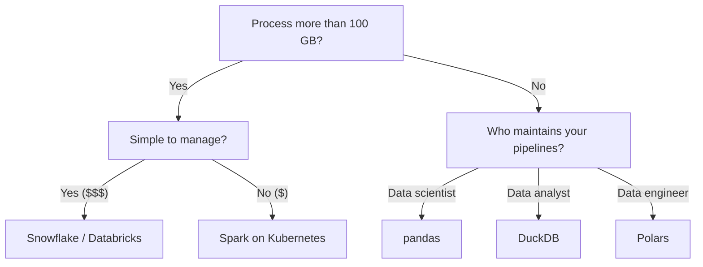
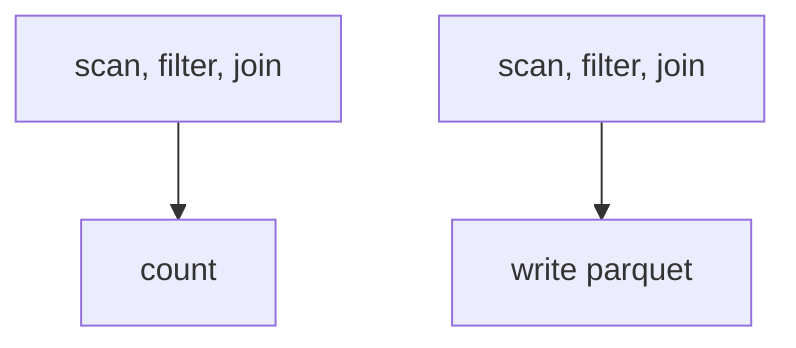
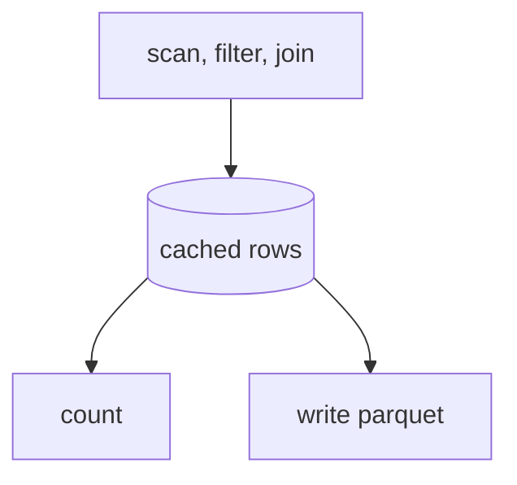

# DataFrame of <span class="dm-accent">Mind</span>

---
layout: agenda
label: Contents
---

# Contents

1. Data and schemas
2. The engines: pandas, DuckDB, Polars
3. Expressing a query
4. How the engine executes it
5. Choosing an engine
6. PySpark

---
layout: section
---

# Data and <span class="dm-accent">schemas</span>

---
layout: default
label: 1 · Data and schemas
---

# Operational vs. <span class="dm-accent">Analytical</span> Data

<div class="ova">
<div class="ova-side">

<div class="ova-pill ova-pill--navy">Operational ⚡</div>

- Detailed events
- Fast and complete (ACID)
- Reads and writes **one record**, all of its fields

</div>

<div class="ova-bits">
  
  <svg class="ova-loop" viewBox="0 0 340 340" v-click="1">
    <path d="M 120.4 33.7 A 145 145 0 1 0 214 36"
          fill="none" stroke="var(--dm-connecting)" stroke-width="12" />
    <polygon points="0,-13 26,0 0,13" transform="translate(219.6, 33.7) rotate(200)"
             fill="var(--dm-connecting)" />
  </svg>
</div>

<div class="ova-side">

<div class="ova-pill ova-pill--violet">Analytical 🔍</div>

- Descriptive and predictive
- Slow and selective
- Reads **one field** across every record

</div>
</div>

<p class="ova-caption" v-click="2">Operations capture reality event by event, analytics finds the
patterns, and the patterns change how the next event is served.</p>

<!--
It is all the same bits in the end, ones and zeros. What differs is the shape of the access. An
operational system grabs a whole record: this customer, this order, right now. An analytical system
grabs one field over millions of records: every order value of the past year. That single difference
drives everything downstream, from the file format to the engine.

During operations we capture the richness of reality, details of every event, so the
business keeps running and customers are served well. Afterwards we understand the patterns hidden
in the chaos, and leverage them to serve customers better, which keeps the business alive.
-->

---
layout: default
label: 1 · Data and schemas
---

# <span class="dm-accent">Rows</span> group records; <span class="dm-accent">columns</span> group fields

<div class="storage-compare">
  <div class="storage-format storage-format--rows">
    <div class="storage-format-head">
      <strong>Row-oriented</strong>
      <span>one line per record</span>
    </div>
    <div class="storage-file" aria-label="The same data stored one record per line">
      <div class="storage-line storage-line--header">id,name,weight_kg,age,heart_rate,country</div>
      <div class="storage-line">8,Ana,210,4,76,CA</div>
      <div class="storage-line">1042,Nanook,480,15,54,NO</div>
      <div class="storage-line">73,Pipaluk,320,9,68,GL</div>
      <div class="storage-line storage-record-run">615,Siku,405,12,61,CA</div>
      <div class="storage-line">204,Nuka,260,6,72,NO</div>
      <div class="storage-line">981,Tala,505,18,52,GL</div>
    </div>
    <p class="storage-question">Give me record <b>615</b></p>
  </div>

  <div class="storage-divider" v-click="1"><span>same data</span></div>

  <div class="storage-format storage-format--columns" v-click="1">
    <div class="storage-format-head">
      <strong>Column-oriented</strong>
      <span>one line per field</span>
    </div>
    <div class="storage-file" aria-label="The same data stored one field per line">
      <div class="storage-line storage-line--header">field,value1,value2,value3,value4,value5,value6</div>
      <div class="storage-line">id,8,1042,73,615,204,981</div>
      <div class="storage-line">name,Ana,Nanook,Pipaluk,Siku,Nuka,Tala</div>
      <div class="storage-line">weight_kg,210,480,320,405,260,505</div>
      <div class="storage-line storage-field-run">age,4,15,9,12,6,18</div>
      <div class="storage-line">heart_rate,76,54,68,61,72,52</div>
      <div class="storage-line">country,CA,NO,GL,CA,NO,GL</div>
    </div>
    <p class="storage-question">Give me the highest <b>age</b></p>
  </div>
</div>

<p class="storage-punch" v-click="2">Same values, different order on disk, different work to retrieve them.</p>

<!--
This is the same tiny dataset written in two different orders. In the row-oriented version, put
your finger at the start of Nanook's line and move right: the whole record arrives in one sweep.
But to read every age, your finger has to jump to each line and count past several numeric fields.
A column-oriented format transposes the physical layout. Now every age is adjacent, while
reconstructing one bear means jumping between fields. Storage layout makes an access pattern cheap
by keeping the values it needs together.
-->

---
layout: statement
title: Exercise - operational vs analytical data
---

# Exercise time: operational vs. analytical data

<p class="mt-6 text-lg opacity-80"><code>1-operational-vs-analytic/</code></p>

---
layout: default
label: 1 · Data and schemas
---

# A schema gives values <span class="dm-accent">meaning</span>

<div class="meaning-flow">
  <div class="meaning-raw">
    <span>A record without context</span>
    <code>1042, Nanook, 480, 15, 54, NO</code>
  </div>

  <div class="meaning-arrow" v-click="1"><b>↓</b> add names and types</div>

  <div class="meaning-fields" v-click="1">
    <div><span>id</span><strong>1042</strong><small>Int64</small></div>
    <div><span>name</span><strong>Nanook</strong><small>String</small></div>
    <div><span>weight_kg</span><strong>480</strong><small>Int64</small></div>
    <div><span>age</span><strong>15</strong><small>Int64</small></div>
    <div><span>heart_rate</span><strong>54</strong><small>Int64</small></div>
    <div><span>country</span><strong>NO</strong><small>String</small></div>
  </div>
</div>

<p class="meaning-punch" v-click="2"><b>Layout</b> tells us where values are.
<b>Schema</b> tells us what they are.</p>

<!--
The previous slide was about how values are stored. A schema solves a different problem: it gives
those values names and types. Without a schema, 15 is just a number. With one, it is an age. Layout
is about location; schema is about interpretation.
-->

---
layout: default
label: 1 · Data and schemas
---

# File formats combine <span class="dm-accent">layout</span> and <span class="dm-accent">schema</span>

<div class="format-slide-body">
<DmColumns class="mt-6">
<DmColumn header="Record-oriented" tone="navy">

- **CSV / TSV**: text; schema supplied or inferred
- **Avro**: binary; writer schema stored with the data

<div class="fmt-logos fmt-logos--center">
  
  
</div>

</DmColumn>
<DmColumn header="Column-oriented" tone="violet" divider>

- **Parquet / ORC**: binary; schema and statistics stored in the file
- **Arrow IPC / Feather**: columnar interchange between tools

<div class="fmt-logos fmt-logos--center">
  
  
  
</div>

</DmColumn>
</DmColumns>

<p class="format-punch">The format changes the physical representation, not what the data means.</p>
</div>

<!--
A file format answers both questions we have introduced: where are the values placed, and how does
the reader know what they mean? CSV keeps records as text and relies on outside knowledge for types.
Avro keeps records together and carries its writer schema. Parquet and ORC group data by column and
carry their schema and statistics. Arrow IPC is designed to exchange columnar data between tools.

You can mention databases and table formats but they sit at another layer. Postgres and DuckDB manage data through an engine;
Delta and Iceberg organize data files into tables. They are useful examples later, but they are not
the same kind of thing as CSV, Avro or Parquet.
-->

---
layout: default
label: 1 · Data and schemas
---

# Different formats, one <span class="dm-accent">DataFrame</span> abstraction

<div class="dataframe-figure">
  <div class="dataframe-example">
    <div class="dataframe-head">id<small>Int64</small></div>
    <div class="dataframe-head">name<small>String</small></div>
    <div class="dataframe-head">weight_kg<small>Int64</small></div>
    <div class="dataframe-head">age<small>Int64</small></div>
    <div class="dataframe-head">heart_rate<small>Int64</small></div>
    <div class="dataframe-head">country<small>String</small></div>
    <div>8</div>
    <div>Ana</div>
    <div>210</div>
    <div>4</div>
    <div>76</div>
    <div>CA</div>
    <div class="dataframe-row-hit">1042</div>
    <div class="dataframe-row-hit">Nanook</div>
    <div class="dataframe-row-hit">480</div>
    <div class="dataframe-row-hit">15</div>
    <div class="dataframe-row-hit">54</div>
    <div class="dataframe-row-hit">NO</div>
    <div>73</div>
    <div>Pipaluk</div>
    <div>320</div>
    <div>9</div>
    <div>68</div>
    <div>GL</div>
    <div>615</div>
    <div>Siku</div>
    <div>405</div>
    <div>12</div>
    <div>61</div>
    <div>CA</div>
    <div>204</div>
    <div>Nuka</div>
    <div>260</div>
    <div>6</div>
    <div>72</div>
    <div>NO</div>
    <div>981</div>
    <div>Tala</div>
    <div>505</div>
    <div>18</div>
    <div>52</div>
    <div>GL</div>
  </div>
  <div class="dataframe-legend">
    <span class="dataframe-row-key"><b>Row</b> · one complete record</span>
    <span class="dataframe-column-key"><b>Column</b> · one typed field across records</span>
  </div>
</div>

<p class="dataframe-punch">Libraries let us work with rows and typed columns, independent of the source format.</p>

<!--
Put tabular data and its schema together and you have the mental model of a DataFrame. Rows are
records; columns are named, typed fields. The source format can change without changing that logical
model. The engines differ in how they execute operations, but they all let us work with this same
abstraction. That is the bridge to the libraries we compare next.
-->

---
layout: section
---

# Bring in the <span class="dm-accent">Animals</span> 🐼 🦆 🐻‍❄️

---
layout: default
label: 2 · The engines
---

# An engine turns a query into <span class="dm-accent">actual work</span>

<div class="flex justify-center mt-2">
  
</div>

<p class="engine-punch">A <b>query engine</b> reads bytes in whatever layout they arrive, applies the
operations you asked for, and writes the result back out.</p>

<!--
Section 1 ended on the DataFrame: rows, typed columns, one logical model regardless of the file
format. That model does not execute itself. Something has to open the file, decide which bytes it
actually needs, run the work and hand back a result. That something is the query
engine, and it is what sits in the middle of every pipeline you will build.

The T in ETL is the engine's job. Extract and load are mostly I/O; the transform is where the
engine earns its keep. For the rest of the course we ask three questions about it, one per section:
how do you express what you want (section 3), how does the engine decide to run it (section 4), and
which engine should you pick (section 5).

The three we compare are pandas, DuckDB and Polars. They all give you the same DataFrame model, so
the interesting differences are underneath it.
-->

---
layout: default
label: 2 · The engines
---

# Three engines, one <span class="dm-accent">DataFrame</span>

<DmComparison
  class="engine-cmp mt-4"
  :rows="['Born 🐣', 'What it is 📖', 'You write 📝', 'Loved by ❤️']"
  :cols="['🐼 pandas', '🦆 DuckDB', '🐻‍❄️ Polars']"
>
  <template #r0c0>2008 🇺🇸</template>
  <template #r0c1>2019 🇳🇱</template>
  <template #r0c2>2020 🇳🇱</template>

  <template #r1c0>The original Python DataFrame library, and still the most widely taught.</template>
  <template #r1c1>A small analytics database that runs inside your Python process.</template>
  <template #r1c2>A newer DataFrame library, built for speed from the start.</template>

  <template #r2c0>Python</template>
  <template #r2c1>SQL</template>
  <template #r2c2>Python</template>

  <template #r3c0>Data scientists 👩‍🔬</template>
  <template #r3c1>Data analysts 👨‍💼</template>
  <template #r3c2>Data engineers 👷</template>
</DmComparison>

<p class="engine-punch">All three hand you the same DataFrame. What differs is how you
<b>ask</b> for it.</p>

<!--
Keep this slide short. It exists so nobody is lost when the next slide shows three snippets, not to
settle the choice.

The "loved by" row is the one to talk around, because it is a real pattern and not a rule. Data
scientists inherited pandas from the notebooks and courses they learned in, analysts reach for
DuckDB because it lets them stay in SQL, and engineers pick Polars when a pipeline has to be fast
and predictable. You can ask the room which of the three they alredy use and create a conversation around it.

Notice the dates. pandas had roughly a decade on its own, and then two engines arrived within a
year of each other. That is not a coincidence: it is what happens when one machine gets big enough
to do work that used to need a cluster. Section 5 has the graph.
-->

---
layout: default
label: 2 · The engines
---

# The same question in <span class="dm-accent">three dialects</span>

<p class="engine-question">Average heart rate per bear, adults only.</p>

<DmColumns class="mt-3" :gap="16">
<DmColumn header="🐼 pandas" tone="navy">

```py
df = pd.read_parquet(path)
adults = df[df["age"] >= 4]
(adults
  .groupby("name")["heart_rate"]
  .mean())
```

</DmColumn>
<DmColumn header="🦆 DuckDB" tone="navy" divider>

```sql
SELECT name, avg(heart_rate)
FROM 'bears.parquet'
WHERE age >= 4
GROUP BY name
```

</DmColumn>
<DmColumn header="🐻‍❄️ Polars" tone="violet" divider>

```py
pl.read_parquet(path)
  .filter(pl.col("age") >= 4)
  .group_by("name")
  .agg(
    pl.col("heart_rate").mean()
  )
```

</DmColumn>
</DmColumns>

<!--
Same question, same answer, three styles.

Three things to point at. pandas mutates and re-binds: `adults` is a new object, and the boolean
mask is a separate expression from the column it filters. DuckDB is pure SQL over a file, with no
Python object in sight. Polars reads as one pipeline, and `pl.col("age")` is not a value but a
description of a column that the engine will resolve later.
-->

---
layout: default
label: 2 · The engines
---

# Polars is a side project that got <span class="dm-accent">out of hand</span> 🤷‍♂️

<DmColumns class="mt-6">
<DmColumn>

- Main author: Ritchie Vink 🇳🇱, a structural engineer by education
- Started during the COVID-19 pandemic 😷, as an exercise in learning Rust
- No database career behind it, so no inherited assumptions: no index, expressions everywhere, Arrow from day one
- Full-time on Polars since July 2023, when he founded Polars Inc. to fund the work
- The company sells enterprise support and Polars Cloud

</DmColumn>
<DmColumn divider>

<div class="flex justify-center">
  
</div>

</DmColumn>
</DmColumns>

<!--
Worth saying out loud: this is a young project with a company attached, and it moves fast. Pin your
version, and read release notes before upgrading.
-->

---
layout: default
label: 2 · The engines
---

# How to read a CSV with <span class="dm-accent">polars</span>

```py
pl.read_csv(
    source: str | Path | IO[str] | IO[bytes] | bytes,
    *,
    has_header: bool = True,
    columns: Sequence[int] | Sequence[str] | None = None,
    new_columns: Sequence[str] | None = None,
    separator: str = ',',
    comment_prefix: str | None = None,
    skip_rows: int = 0,
    skip_lines: int = 0,
    schema: SchemaDict | None = None,
    schema_overrides: Mapping[str, PolarsDataType] | Sequence[PolarsDataType] | None = None,
    null_values: str | Sequence[str] | dict[str, str] | None = None,
    infer_schema: bool = True,
    infer_schema_length: int | None = 100,
    ..., # there are many more arguments you can pass check 
) -> DataFrame
```

<p class="text-sm opacity-80">Full argument list: <a href="https://docs.pola.rs/api/python/stable/reference/api/polars.read_csv.html" target="_blank">docs.pola.rs · read_csv</a></p>

<p class="ova-caption" v-click="1">A CSV may name its columns, never their <span class="dm-accent">types</span>. Since Polars works with DataFrames, you will need to help it understanding the schema.</p>


<!--
Look at the defaults, they are the whole story. `has_header=True` assumes a header. `separator=','`
assumes commas. `try_parse_dates=False` means dates arrive as strings unless you ask. Each default
is a guess about a file the library has never seen, and `schema` or `schema_overrides` is how you
replace a guess with a decision.

The failure mode to name out loud: a wrong guess does not raise. The read succeeds, the column is a
String instead of a date or a number, and nobody notices until a join returns nothing. So the habit
is to look at `df.schema` before you look at the data.
-->

---
layout: statement
title: Demo - reading a dirty csv
---

# Exercise time: a dirty, dirty CSV

<p class="mt-6 text-lg opacity-80"><code>2-csv-from-hell/</code></p>

<!--
Two files, both deliberately awful, and no README hand-holding: they have the arguments from the
previous slide and the docs. Let them hit the error messages.

The checkpoint question when they say they are done: "is every column the type you want?" Most
people stop at "it read without an error" and leave numbers and timestamps sitting as strings.
-->

---
layout: section
---

# Expressing a <span class="dm-accent">query</span>

<!--
Section 2 left them with three engines and one sentence: all three hand you the same DataFrame,
what differs is how you ask for it. This section is about the asking.
-->


---
layout: default
label: 3 · Expressing a query
---

# Imperative and <span class="dm-accent">declarative</span> query styles

<DmColumns class="mt-4" :gap="16">
<DmColumn header="Imperative Python" tone="navy" style="flex: 1 1 0">

```py
seniors = []
rows = bears.iter_rows(named=True)
for row in rows:
  if row["age"] >= 15:
    seniors.append(row)
```

The loop fixes the iteration order and mutates the result.

</DmColumn>
<DmColumn header="Declarative" tone="violet" divider style="flex: 2 1 0">

<DmColumns :gap="16">
<DmColumn header="SQL text" tone="plain">

```sql
SELECT *
FROM bears
WHERE age >= 15
```

The query describes the result. The engine chooses an execution plan.

</DmColumn>
<DmColumn header="Polars expressions" tone="plain" divider>

```py
senior = pl.col("age") >= 15
seniors = bears.filter(senior)
```

Describe the filter using a Python expression.

</DmColumn>
</DmColumns>
</DmColumn>
</DmColumns>

<p class="mt-4">With declarative queries, you describe the transformation; the engine handles the row processing.</p>

<!--
The point to land is not that one syntax wins. Imperative code specifies the procedure, including
iteration order and mutation. SQL and Polars expressions describe a result without spelling out a
row-by-row procedure. That distinction gives an engine room to optimise the work it can see.

SQL supplies a declarative description as text. Polars supplies expression objects in Python.
`senior` can be named, reused and composed with other expressions, but it is not itself a function.
-->

---
layout: default
label: 3 · Expressing a query
---

# Relational algebra, the cornerstone of <span class="dm-accent">RDBMS</span>

<div class="flex justify-center mt-6">
  
</div>

<p class="text-center mt-4 opacity-80">Projection, selection, rename, set operations and the whole family of joins.</p>

<!--
Voilà, summarised in a single slide.

Not spend much time on this. The message is that no matter which interface you use to transform data,
in the end you're doing relational algebra, which is well studied and adopted. We'll see some
of these operations in the next slides, with polars syntax.
-->

---
layout: default
label: 3 · Expressing a query
---

# Project, filter, rename, <span class="dm-accent">union</span>

`more_bears` contains additional bears with the same columns as `bears`.

<DmColumns class="mt-3" :gap="16">
<DmColumn header="SQL" tone="navy">

```sql
SELECT name, weight_kg AS weight
FROM (
    SELECT name, weight_kg
    FROM bears
    UNION ALL
    SELECT name, weight_kg
    FROM more_bears
) AS combined
WHERE weight_kg > 400
```

</DmColumn>
<DmColumn header="Polars" tone="violet" divider>

```py
heavy_bears = (
  pl.concat([
    bears.select("name", "weight_kg"),
    more_bears.select("name", "weight_kg"),
  ])
  .rename({"weight_kg": "weight"})
  .filter(pl.col("weight") > 400)
)
```

</DmColumn>
</DmColumns>

<!--
The queries are doing the exact same thing, the operations only have different names and interfaces.
-->

---
layout: default
label: 3 · Expressing a query
---

# Beyond relational algebra: contexts and <span class="dm-accent">expressions</span>

Polars adds its own DSL on top of the relational engine. An **expression** is a tree of operations
describing how to build one or more Series. Expressions are always evaluated inside a **context**:
`select`, `with_columns`, `filter` and `group_by`.

```py {all|1-2|3-4|5-6|all}
query = bears.with_columns(                              # context
    (pl.col("weight_kg") / 1000).alias("weight_tonnes")    # expression
).filter(                                               # context
    pl.col("age") >= 15                                  # expression
).select(                                               # context
    pl.col("name"), pl.col("weight_tonnes")               # expressions
)
```

<!--
Two words, and both are load-bearing. An expression is a *recipe* for a Series: it knows nothing
about which table it will run against, which is exactly why you can name it, reuse it, pass it to a
function and unit-test it. A context is *where* the recipe is evaluated, and it decides the shape
of what comes back.
Click through it once, naming context and expression alternately.
-->

---
layout: default
label: 3 · Expressing a query
---

# One expression, four <span class="dm-accent">contexts</span>

<p class="ctx-sub">The expression never changes: <code>heaviest = pl.col("weight_kg").max().alias("max_kg")</code>.
The context decides what comes back.</p>

<div class="ctx">
  <div class="ctx-row ctx-head"><div>Context</div><div>Rows out</div><div>What you asked for</div></div>
  <div class="ctx-row">
    <div class="ctx-code"><code>bears.select(heaviest)</code></div>
    <div><div class="ctx-shape">1</div></div>
    <div class="ctx-what">One answer for the whole table: 505 kg.</div>
  </div>
  <div class="ctx-row">
    <div class="ctx-code"><code>bears.with_columns(heaviest)</code></div>
    <div><div class="ctx-shape">6</div></div>
    <div class="ctx-what">A new max_kg column, with 505 on every row.</div>
  </div>
  <div class="ctx-row">
    <div class="ctx-code"><code>bears.group_by("country").agg(heaviest)</code></div>
    <div><div class="ctx-shape">3</div></div>
    <div class="ctx-what">One maximum per country: CA 405, NO 480, GL 505.</div>
  </div>
  <div class="ctx-row">
    <div class="ctx-code"><code>bears.filter(pl.col("weight_kg") == heaviest)</code></div>
    <div><div class="ctx-shape">1</div></div>
    <div class="ctx-what">Tala's row. Tied maxima would return multiple rows.</div>
  </div>
</div>

<p class="ctx-note">You are not calling functions on data. You are handing the engine a
<b>description</b> and a place to evaluate it.</p>

---
layout: default
label: 3 · Expressing a query
---

# Polars comes with a big bag of <span class="dm-accent">batteries</span> included

<DmColumns class="mt-4" :gap="16">
<DmColumn header="Column selectors" tone="navy">

```py
import polars.selectors as cs

bears.select(cs.numeric())
bears.select(
  cs.starts_with("weight")
)
```

Meta-queries over the schema, instead of hard-coded column lists.

</DmColumn>
<DmColumn header="Type namespaces" tone="navy" divider>

```py
bears.with_columns(
  pl.col("name")
    .str.to_uppercase()
)
```

Type-specific functions live in `.str`, `.dt`, `.list` and `.struct`.

For date columns, `.dt.year()` extracts the year.

</DmColumn>
<DmColumn header="Testing helpers" tone="violet" divider>

```py
from polars.testing import (
  assert_frame_equal)

assert_frame_equal(
  bears.select("name"),
  bears.select("age"),
)
# AssertionError
```

Frame and series comparisons that fail with a readable message.

</DmColumn>
</DmColumns>

<!--
Three conveniences, and the first two are needed in the next thirty minutes, which is why this
slide sits here and not later.
-->

---
layout: statement
title: Exercise - relational algebra
---

# Exercise time: relational algebra

<p class="mt-6 text-lg opacity-80"><code>3-basic-transforms/</code></p>

<!--
Checkpoint question when they say they are done: "which of your answers would break if a vet typed
a name in lowercase?"
-->

---
layout: default
label: 3 · Expressing a query
---

# To SQL or not to <span class="dm-accent">SQL</span>?

<DmColumns class="mt-4">
<DmColumn header="SQL wins on" tone="navy">

- Readability
- Getting stuff done
- Easy to learn, everyone speaks it


</DmColumn>
<DmColumn header="A DataFrame API wins on" tone="violet" divider>

- Abstraction (functions, modules)
- Control flow (if, for, while)
- Testing
- Ecosystem (linting, typing, packaging)

</DmColumn>
</DmColumns>

<div class="flex justify-center mt-2">
  
</div>

---
layout: default
label: 3 · Expressing a query
---

# Compose a pipeline from <span class="dm-accent">small functions</span>

<DmColumns class="mt-4" :gap="16">
<DmColumn header="Define the transformations" tone="navy">

```py
def clean_names(df):
    return df.with_columns(
        pl.col("name")
        .str.strip_chars()
        .str.to_lowercase()
    )

def keep_seniors(df):
    return df.filter(pl.col("age") >= 15)
```

Each function returns a transformed frame, leaving its input and external state unchanged.

</DmColumn>
<DmColumn header="Compose them with pipe" tone="violet" divider>

```py
seniors = (
    vet
    .pipe(clean_names)
    .pipe(keep_seniors)
)
```

`df.pipe(f)` means `f(df)`.

Name each step once, reuse it in other pipelines, and test it on a few rows.

</DmColumn>
</DmColumns>

<!--
The SQL discussion just promised abstraction and testing. Show what those mean using operations
the room already knows from exercise 3. clean_names addresses the inconsistent bear names;
keep_seniors reuses the filter from the imperative/declarative slide.

Read the functions first, then the pipeline. Both follow DataFrame -> DataFrame. The functions
return their results without modifying the input or external state. That makes each one easy to
test with a tiny input frame and assert_frame_equal, independently of the rest of the pipeline.
Ask them to extract one transformation from their exercise answer into a function and call it
with pipe. Keep this to a short refactor of work they already have.

Only after the example, name the idea: this is a practical application of functional programming,
composing small transformations without shared mutable state. pipe is a higher order function:
it accepts another function. It calls that function once with the frame, not once per row.
The purity comes from how we wrote these functions; pipe does not enforce it.

These functions use native Polars expressions throughout. In section 4, pass a LazyFrame through
the same functions to show that the operations still build a query plan the optimiser can see.

Source: https://docs.pola.rs/api/python/stable/reference/dataframe/api/polars.DataFrame.pipe.html
-->

---
layout: default
label: 3 · Expressing a query
---

# Windowing and <span class="dm-accent">aggregations</span>

<DmColumns class="mt-4">
<DmColumn header="Window: one row in, one row out" tone="navy">

```py
measurements.with_columns(
  pl.col("weight")
  .mean()
  .over("life_stage")
  .alias("avg_for_stage")
)
# 3 291 rows in, 3 291 rows out
```

Calculate a value over a group and add it to every record of that group.

</DmColumn>
<DmColumn header="Aggregation: one group, one row" tone="violet" divider>

```py
measurements.group_by("life_stage").agg(
  pl.col("weight")
  .mean()
  .alias("avg_for_stage")
)
# 3 291 rows in, 4 rows out
```

Calculate a value over a group and return one record per group.

</DmColumn>
</DmColumns>

<p class="win-note">Same expression, same grouping. The <b>context</b> decides whether you keep
your rows.</p>

---
layout: default
label: 3 · Expressing a query
---

# Aggregations that return a <span class="dm-accent">row</span>, not a value

```py
# the whole latest reading per bear, not just the latest timestamp
measurements.group_by("name").agg(pl.all().sort_by("timestamp").last())

# which bear was most active, per life stage per year
measurements.group_by("life_stage", pl.col("timestamp").dt.year().alias("year")).agg(
    pl.col("name").sort_by("daily_steps").last().alias("most_active"),
    pl.col("daily_steps").max(),
)

# an ordered window: no .sort() beforehand, the window sorts itself
measurements.with_columns(
    pl.col("weight").rolling_mean(window_size=3).over("name", order_by="timestamp")
)
```

<p class="win-note"><code>sort_by</code> inside an aggregation is the answer to "<b>which</b> one",
and <code>order_by</code> is what makes a window trustworthy.</p>

<!--
You can mention the importance of sort_by/order_by when making aggregations to make sure output
of the transformation is deterministic and not random.
-->

---
layout: statement
title: Exercise - windowing and aggregations
---

# Exercise time: windowing and aggregations

<p class="mt-6 text-lg opacity-80"><code>4-window-aggregations/</code></p>

---
layout: default
label: 3 · Expressing a query
---

# The standard <span class="dm-accent">join types</span>

<div class="flex justify-center mt-2">
  
</div>

---
layout: default
label: 3 · Expressing a query
---

# Polars supports all <span class="dm-accent">standard</span> join operations

```py
DataFrame.join(
    other: DataFrame,
    on: str | Expr | Sequence[str | Expr] | None = None,
    how: JoinStrategy = 'inner',        # left, right, full, semi, anti, cross
    *,
    left_on: str | Expr | Sequence[str | Expr] | None = None,
    right_on: str | Expr | Sequence[str | Expr] | None = None,
    suffix: str = '_right',             # what happens to colliding column names
    validate: JoinValidation = 'm:m',   # 1:1, 1:m, m:1
    join_nulls: bool = False,
    coalesce: bool | None = None,
) -> DataFrame
```

```py
sensor.join(vet, on="name")               # 158 016 x 3 291 -> 90 475 536 rows
sensor.join(vet, on="name", validate="m:1")
# ComputeError: join keys did not fulfill m:1 validation
```

<p class="win-note"><code>validate</code> turns a silent row explosion into an error. It costs one
argument and it is the cheapest test in this course.</p>

---
layout: default
label: 3 · Expressing a query
---

# ... and even <span class="dm-accent">non-standard</span> joins

```py
sensor.join_asof(
    measurements.select("name", "timestamp", "vet_health_check"),
    on="timestamp",              # both sides must be sorted on this
    by="name",                   # exact match on the bear, nearest match on the time
    strategy="backward",         # the most recent verdict at or before the reading
    tolerance="7d",              # beyond this, null instead of a stale answer
)
# 158 016 rows in, 158 016 rows out
```

Match on the nearest key rather than an exact one. Useful for time series: sensor readings joined
to the most recent configuration change.

<p class="win-note"><code>join_where</code> is the general case: join on any predicate, not just
equality.</p>

---
layout: statement
title: Exercise - joins
---

# Exercise time: joins

<p class="mt-6 text-lg opacity-80"><code>5-joins/</code></p>

---
layout: section
---

# How the engine <span class="dm-accent">executes</span> it

---
layout: default
label: 4 · How the engine executes it
---

# Lazy vs. <span class="dm-accent">eager</span> evaluation

<DmColumns class="mt-2">
<DmColumn header="Eager: read_csv" tone="navy">


Every step runs the moment you write it. Fine for exploration, wasteful for pipelines.

</DmColumn>
<DmColumn header="Lazy: scan_csv" tone="violet" divider>


Nothing runs until `.collect()`. The optimiser sees the whole query and rewrites it.

</DmColumn>
</DmColumns>


---
layout: default
label: 4 · How the engine executes it
---

# Some optimisations: <span class="dm-accent">pushdown</span>

<DmColumns class="mt-4">
<DmColumn>

- **Predicate pushdown**: filter rows as early as possible
- **Projection pushdown**: drop columns as early as possible
- **Slice pushdown**: read only the rows a `head` or `slice` actually needs

Applied while reading the data. Parquet stores min/max statistics per row group, so the engine
skips whole groups and those rows never enter memory at all.

</DmColumn>
<DmColumn divider>

<div class="flex justify-center">
  
</div>

</DmColumn>
</DmColumns>

---
layout: default
label: 4 · How the engine executes it
---

# Some optimisations: join <span class="dm-accent">reordering</span>

<div class="flex justify-center mt-2">
  
</div>

<p class="text-center mt-2 opacity-80">Same three inputs, same result, 6 million intermediate rows of difference.</p>

<!--
Simply decides which branch of the joins to execute first. No facny reordering

[Sources]
- https://docs.pola.rs/user-guide/lazy/optimizations/
-->

---
layout: default
label: 4 · How the engine executes it
---

# Polars streaming: when you are <span class="dm-accent">resource-constrained</span>

Instead of processing the data all at once, Polars can execute the query in batches, which lets you
process datasets larger than memory.

<DmColumns class="mt-4">
<DmColumn>

```py
q1 = (
    pl.scan_csv("car.csv")
    .filter(pl.col("price") < 30_000)
    .group_by("brand")
    .agg(pl.col("max_speed").max())
)
df = q1.collect(engine="streaming")
```

</DmColumn>
<DmColumn header="What streams" tone="navy" divider>

Most of the API streams: `scan_csv`, `scan_parquet`, `scan_ipc`, `select`, `with_columns`,
`filter`, `slice`, `group_by`, `join`, `unique`, `sort`, `explode`, `unpivot`.

Anything that cannot stream falls back to the in-memory engine on its own, so a query never fails
for this reason. To see which part does what:
`show_graph(plan_stage="physical", engine="streaming")`.

</DmColumn>
</DmColumns>

---
layout: default
label: 4 · How the engine executes it
---

# A bit <span class="dm-accent">unread</span> is a bit less to process

<div class="flex justify-center mt-2">
  
</div>

<p class="mt-4">Pushdown is the engine skipping bytes for you. It can only skip what the layout
allows, so partition along the column you filter on first.</p>

<!--
Interactive discussion: suppose you have a large collection of parquet files, but are only
interested in a subset of the data (e.g. year = 2019). How do you query the data efficiently?
-->

---
layout: statement
title: Demo - hive partitioning
---

# Demo: hive-partitioned vs. plain Parquet

---
layout: default
label: 4 · How the engine executes it
---

# When SQL doesn't cut it: user defined <span class="dm-accent">functions</span>

<DmColumns class="mt-4" :gap="16">
<DmColumn header="map_rows" tone="navy">

```py
df.map_rows(
  lambda t: (t[0] * 2, t[1] * 3)
)
```

Every row as a tuple. Column names are lost, and it is the slowest of the three.

</DmColumn>
<DmColumn header="map_batches" tone="navy" divider>

```py
pl.col("features").map_batches(
  lambda s: model.forward(
    s.to_numpy())
)
```

The whole Series at once, so NumPy and PyTorch run once per column.

</DmColumn>
<DmColumn header="map_elements" tone="violet" divider>

```py
pl.col("a").map_elements(
  lambda x: x * 2,
  return_dtype=pl.Int64,
)
```

One value at a time. Pass `return_dtype` or Polars infers it from the first result.

</DmColumn>
</DmColumns>

<p style="margin-top: 32px;">Every UDF drops out of the optimised engine and back into the Python interpreter, so check for a builtin first.</p>


---
layout: statement
title: Exercise - user defined functions
---

# Exercise time: UDFs

<p class="mt-6 text-lg opacity-80"><code>6-udf/</code></p>

---
layout: section
---

# Big <span class="dm-accent">Data</span>?

---
layout: default
label: 5 · Choosing an engine
---

# The data processing landscape over the <span class="dm-accent">years</span>

<EraTimeline />

<div class="mt-12">

- 📈 First wave optimised for **scale**: commodity machines, open source, structured and
  semi-structured data

<v-clicks>

- 💆 Second wave optimised for **simplicity**: managed platforms hid the cluster
- 💰 Third wave optimised for **cost**: Kubernetes brought the cluster back, cheaper

</v-clicks>

</div>

<!--
The promise of Spark and distributed processing was: scaling out cheaply on commodity machines,
relying on open source so you are not locked in to a vendor, and supporting both structured and
semi-structured data. The downside was that distributed processing was difficult.

The bottleneck then shifted towards maintaining the cluster of machines. Companies struggled with
managing them, which is why the second evolution introduced managed systems that abstract away the
complexity: Snowflake and Databricks. In 2018, Spark answered these private companies by leveraging
Kubernetes.

If we plot these three characteristics as the corners of a triangle...
-->

---
layout: default
label: 5 · Choosing an engine
---

# Emerging single node processing <span class="dm-accent">technologies</span>

<TradeoffTriangle />

<!--
Separation of compute and storage allowed for effective scalability. The main evolution over the
past years was to simplify this complex cluster of machines, which resulted in expensive systems
(Snowflake, Databricks). The alternative was doing everything yourself, which takes time and
requires a strong team.

On the click: not all pipelines need to scale to terabytes. Single machine specs in the cloud have
improved a lot, which created room for Polars and DuckDB. Pandas has been around since 2008.
-->

---
layout: default
label: 5 · Choosing an engine
---

# Interest in big data, and what one machine <span class="dm-accent">now holds</span>

<DmColumns class="mt-4">
<DmColumn header="Interest in 'big data' is past its peak" tone="navy">


</DmColumn>
<DmColumn header="One machine now holds 12 TB of RAM" tone="violet" divider>


</DmColumn>
</DmColumns>

---
layout: default
label: 5 · Choosing an engine
---

# You can't please all of the people all the time, luckily there is an <span class="dm-accent">escape hatch</span>

<ArrowHub />

<!--
TODO in the original: rework the arrow image to use other technologies and formats.

Arrow is the columnar memory format that Spark, pandas, Polars and DuckDB all speak, and it reads
from the same files and object stores they do. Handing a DataFrame from one engine to another costs
no serialisation, so the choice of engine can be made per step instead of per project. That is the
escape hatch: you are not locked into the engine you started with.
-->

---
layout: default
label: 5 · Choosing an engine
---

# When do I use <span class="dm-accent">what</span>?


```mermaid {scale: 0.72}
graph TD
  A["Process more than 100 GB?"] -->|Yes| B["Simple to manage?"]
  A -->|No| C["Who maintains your pipelines?"]
  B -->|"Yes ($$$)"| D["Snowflake / Databricks"]
  B -->|"No ($)"| E["Spark on Kubernetes"]
  C -->|"Data scientist"| F["pandas"]
  C -->|"Data analyst"| G["DuckDB"]
  C -->|"Data engineer"| H["Polars"]
```

---
layout: section
---

# Apache <span class="dm-accent">Spark</span>

---
layout: default
label: 6 · PySpark
---

# The same query in <span class="dm-accent">PySpark and Polars</span>

<DmColumns class="mt-4">
<DmColumn header="PySpark" tone="navy">

```py
from pyspark.sql import SparkSession
from pyspark.sql.window import Window
import pyspark.sql.functions as sf

spark = SparkSession.builder.getOrCreate()

df = (
  spark.read.csv("measurements.csv")
  .withColumn("year", sf.year("timestamp"))
  .withColumn("max_weight_per_year",
              sf.max("weight")
              .over(Window.partitionBy("year"))
              )
)

df.collect()
```

</DmColumn>
<DmColumn header="Polars" tone="violet" divider>

```py
import polars as pl

df = (
  pl.scan_csv("measurements.csv")
  .with_columns(
    pl.col("timestamp").dt.year()
    .alias("year")
  )
  .with_columns(
    pl.col("weight").max().over("year")
    .alias("max_weight_per_year")
  )
)

df.collect()
```

</DmColumn>
</DmColumns>

<p class="mt-4">Both express the same operations, and both are lazy. The rest of this section covers
what changes when the work runs on a cluster instead of in one process.</p>

---
layout: default
label: 6 · PySpark
---

# Large jobs are limited by <span class="dm-accent">I/O</span>, and a cluster adds bandwidth

<DmColumns class="mt-4">
<DmColumn>

<DmColumn header="One machine" tone="navy">

- One network card, one set of disks: a few GB/s at best
- 10 TB at 1 GB/s: three hours before any computation starts
- The CPUs idle, waiting for bytes

</DmColumn>

<DmColumn header="A cluster" tone="violet" class="mt-5">

- Every executor reads its own slice, so bandwidth grows with the machine count
- 10 TB across 60 executors: minutes, if the object store keeps up
- Memory scales the same way

</DmColumn>

</DmColumn>
<DmColumn divider>

<div class="flex justify-center">
  
</div>

</DmColumn>
</DmColumns>

<!--
Easy to miss: distributing is not mainly about CPU, it is about I/O. A single machine is capped by
its network card and its disks, and on a large scan the processors are idle most of the time,
waiting for bytes. The Goliath on the left is that machine: an impressive engine with one entrance,
and everyone queues at it. Making the locomotive bigger does not shorten the queue.

Add machines and the aggregate read bandwidth grows with them, which is why a cluster finishes a
10 TB scan in minutes rather than hours. That is the city line on the right: three cars, every car
with its own door, passengers boarding in parallel. The numbers are round arithmetic, not a
benchmark: 1 GB/s per machine, 10 TB, 60 executors.

The doors only help if the platform can feed them, which is the object store caveat, and the same
reason a badly partitioned dataset leaves executors idle.

It also explains why the first half mattered: columnar formats and partitioning shrink the bytes you
read in the first place, and that helps on one machine and on sixty.
-->

---
layout: default
label: 6 · PySpark
---

# A submitted job runs on a <span class="dm-accent">driver and its executors</span>

Scaling out means adding machines rather than buying a bigger one. This is the machinery that makes
that possible.

<DmColumns class="mt-3">
<DmColumn>


Your program runs in the driver. The cluster manager allocates executors on worker nodes, and the
driver ships the code and the tasks to them.

</DmColumn>
<DmColumn divider>

```bash
$ ./bin/spark-submit \
    --master k8s://https://<host>:<port> \
    --deploy-mode cluster \
    --name spark-pi \
    --conf spark.executor.instances=5 \
    --conf spark.kubernetes.container.image=<image> \
    local:///path/to/examples.jar
```

`spark-submit` sets `SPARK_HOME` and `JAVA_HOME` and hands your program to the launcher.

Note the arrow between the workers: executors talk to each other, not only to the driver. The next
slide is about that arrow.

</DmColumn>
</DmColumns>

<!--
1. To start a Spark application, you submit it. spark-submit comes bundled with the Spark binary and
   is a short script that sets environment variables, looks for a Java installation and passes
   options to the launcher, written in Java.
2. Your program starts a SparkContext, in the driver process. It connects to a cluster manager and
   asks for computing resources.
3. The cluster manager allocates them to executor processes on the worker nodes.
4. Spark sends the application code and its dependencies to the executors, then sends tasks.

The cluster manager keeps checking the workers are alive and the driver listens for new worker
announcements, which is where resiliency comes from.
-->

---
layout: default
label: 6 · PySpark
---

# Wide transformations <span class="dm-accent">shuffle</span> data across the network

<DmColumns class="mt-3">
<DmColumn header="Narrow: no data moves" tone="navy">

`select`, `filter`, `withColumn`, `union`

Each executor works on the partitions it already holds. Spark chains these into one stage.

</DmColumn>
<DmColumn header="Wide: rows meet on one executor" tone="violet" divider>

`groupBy`, `join`, `distinct`, `sort`, `repartition`

All rows with the same key have to end up in the same place, so Spark writes shuffle files and moves
them over the network. That ends a stage and starts the next.

</DmColumn>
</DmColumns>

```py
df.filter(sf.col("age") > 18).groupBy("country").count().explain()
# AdaptiveSparkPlan isFinalPlan=false                        (abridged)
# +- HashAggregate(keys=[country], functions=[count(1)])
#    +- Exchange hashpartitioning(country, 200)     <- the shuffle
#       +- HashAggregate(keys=[country], [partial_count(1)])
#          +- Filter (age > 18)
```

<p class="mt-2">No Polars equivalent: in one process a <code>group_by</code> is a hash table, not a
network transfer.</p>

---
layout: default
label: 6 · PySpark
---

# <span class="dm-accent">Partition count</span> decides how much of the cluster stays busy

<DmColumns class="mt-2" :gap="16">
<DmColumn header="72 vCPUs, idle at the tail" tone="navy">


</DmColumn>
<DmColumn header="Partitions matched to cores" tone="violet" divider>


</DmColumn>
</DmColumns>

<p class="mt-3">The 200 in that <code>Exchange</code> is the default of
<code>spark.sql.shuffle.partitions</code>, applied to every shuffle whatever your data or cluster
size. Make it a multiple of the cluster cores. Since Spark 3.2 adaptive execution coalesces them at
runtime, so treat 200 as a starting point.</p>

<!--
A cluster of 72 CPUs over 9 nodes. On the partition distribution (top left) the workers process
partitions in parallel, but near the end some CPUs start idling: the load drops to about 25% for
roughly 5 minutes. Wasting 75% of a 72 vCPU cluster for 5 minutes is costly.

The fix is to make the partition count a multiple of the vCPU count, which is what was done on the
right. The blocks are smaller because there are more partitions, the total work is the same. Memory
usage was only 50%, so memory could be halved and the CPU count doubled for the same price.
-->

---
layout: default
label: 6 · PySpark
---

# Transformations are <span class="dm-accent">lazy</span>, actions trigger execution

<DmColumns class="mt-4">
<DmColumn>

```py
import pyspark.sql.functions as sf

df1 = spark.range(3)
df2 = df1.withColumn("foo", sf.lit("bar"))
df3 = df2.withColumn("bar", sf.col("id") < 2)
df4 = df3.filter(sf.col("id") != 1)
df5 = df4.select("foo", "bar", "id",
                 (sf.col("id") + 2).alias("plus2"))
df6 = df5.drop("id")
df7 = df6.withColumnRenamed("bar", "lessthan2")

df7.printSchema()   # free: bookkeeping only
print(df7.count())  # action: the plan runs
df7.show()          # action
```

</DmColumn>
<DmColumn divider>

Polars taught you this with `scan_csv` and `collect`. Spark works the same way: transformations
build a plan, actions run it.

Two things are different once the plan runs on a cluster:

- ⚠️ Errors surface at the **action**, not at the line that caused them, and they arrive as a Java
  stack trace from an executor.
- `DataFrame.explain()` shows the physical plan, including every `Exchange`.

</DmColumn>
</DmColumns>

---
layout: default
label: 6 · PySpark
---

# Chaining drops the intermediate names, <span class="dm-accent">transform</span> makes steps testable

<DmColumns class="mt-3" :gap="16">
<DmColumn header="Chain the calls" tone="navy">

```py
df = (
    spark.range(3)
    .withColumn("foo", sf.lit("bar"))
    .withColumn("bar", sf.col("id") < 2)
    .filter(sf.col("id") != 1)
    .select("foo", "bar", "id",
            (sf.col("id") + 2).alias("plus2"))
    .drop("id")
    .withColumnRenamed("bar", "lessthan2")
)
```

No `df1` to `df7` to keep straight, and no filtering `df3` when you meant `df4`.

</DmColumn>
<DmColumn header="Name the steps with transform" tone="violet" divider>

```py
def add_flags(df: DataFrame) -> DataFrame:
    return (df
        .withColumn("foo", sf.lit("bar"))
        .withColumn("bar", sf.col("id") < 2))

def drop_middle(df: DataFrame) -> DataFrame:
    return df.filter(sf.col("id") != 1)

df = (spark.range(3)
      .transform(add_flags)
      .transform(drop_middle))
```

A `DataFrame -> DataFrame` function is testable on three rows, no cluster involved.
`transform` is PySpark's pipe; Polars spells it `.pipe()`.

</DmColumn>
</DmColumns>

<!--
The reassignment style on the previous slide is what most PySpark code in the wild looks like. It
reads top to bottom, but every intermediate name is a chance to reference the wrong one, and none of
the steps can be tested on its own.

Chaining fixes the naming. transform fixes the testing: the moment a step is a named function taking
a DataFrame and returning a DataFrame, it can be unit tested with a handful of rows, and the same
function works in a pipeline of any size.
-->

---
layout: default
label: 6 · PySpark
---

# A DataFrame used twice is computed twice, unless you <span class="dm-accent">cache</span> it

<DmColumns class="mt-2" :gap="16">
<DmColumn header="Two actions, two full recomputations" tone="navy">


```mermaid {scale: 0.42}
graph TD
  A["scan, filter, join"] --> D["count"]
  A2["scan, filter, join"] --> E["write parquet"]
```

</DmColumn>
<DmColumn header="Cached: computed once, read twice" tone="violet" divider>


```mermaid {scale: 0.42}
graph TD
  A["scan, filter, join"] --> M[("cached rows")]
  M --> D["count"]
  M --> E["write parquet"]
```

</DmColumn>
</DmColumns>

```py
enriched = (spark.read.parquet("events")
            .filter(sf.col("year") == 2024)
            .join(dim_user, "user_id")
            .cache())          # lazy too: the first action fills it
enriched.count()               # computes, then keeps the rows
enriched.write.parquet("out")  # reads the cache instead
```

<p class="mt-3">Only worth it when one DataFrame feeds more than one action. Call
<code>unpersist()</code> when the branch is done.</p>

<!--
A Spark plan is lineage, not a result. Every action walks the plan back to the source, so a
DataFrame used by two actions is computed twice, all the way from the files.

cache() marks it to be kept after the first action computes it. persist() is the same thing with a
storage level you choose. Neither computes anything on its own.

The default storage level for a DataFrame is MEMORY_AND_DISK, so a cached frame that does not fit
in memory spills, and you pay for both the memory pressure and the disk read.

Ask the room: where would you put a cache in a pipeline that writes three reports from one joined
dataset? And what happens if the cached frame is bigger than the executor memory?
-->

---
layout: default
label: 6 · PySpark
---

# A UDF runs Python per row, <span class="dm-accent">outside</span> Spark's optimiser

<DmColumns class="mt-4">
<DmColumn>

```py
import pyspark.sql.functions as sf
from pyspark.sql.types import IntegerType

def square(x):
    return x**2

square_as_udf = sf.udf(
    square, returnType=IntegerType())
df.withColumn("squared", square_as_udf("id"))
```

You must declare the return type: the optimiser cannot infer it from Python.

</DmColumn>
<DmColumn divider>

In Polars a UDF drops from Rust into Python in the same process. In Spark, every row is serialised
out of the JVM into a separate Python worker and back again.

That round trip is why `pandas_udf` exists: it hands the worker an Arrow batch instead of a row, so
the crossing happens once per batch.

The rule from the Polars half still holds, only more so: look for a builtin first.

</DmColumn>
</DmColumns>

<!--
Higher order functions are a feature people know from functional programming. udf takes a function
and returns a new function.
-->

---
layout: default
label: 6 · PySpark
---

# One core, four libraries: <span class="dm-accent">SQL, streaming, MLlib, GraphX</span>

<div class="flex justify-center mt-2 mb-4">
  
</div>

<DmProcess class="mt-4">
<DmPhase label="SQL" />
<DmPhase label="Streaming" />
<DmPhase label="MLlib" />
<DmPhase label="GraphX" />
</DmProcess>

<p style="margin-top: 28px;">All four sit on the Spark core, whose abstraction is the resilient
distributed dataset (RDD). The core also handles task dispatch, scheduling and I/O.</p>

<p class="mt-2">They share one API and one deployment, in Scala, Java, Python, R and SQL with almost
identical names. Training a model on a batch and then scoring a stream needs no second system.</p>

<!--
Spark offers SQL-like queries against massive datasets. Streaming processes data as it arrives, like
sensor readings from an IoT device. MLlib covers machine learning. GraphX handles graph-like data
where relations matter.

Even though Spark is written in Scala, it has bindings in 5 officially supported languages. Whatever
you learn in one language is named identically in the others, R excepted.
-->

---
layout: default
label: 6 · PySpark
---

# Batch and streaming share the <span class="dm-accent">same transformations</span>

<DmColumns class="mt-4">
<DmColumn header="Batch: aggregate a database table" tone="navy">

```py
df = (spark
  .read
  .format("jdbc")
  .option("url", url)
  .option("dbtable", "people")
  .load()
  )

counts_by_age = df.groupBy("age").count()
```

</DmColumn>
<DmColumn header="Streaming: count words as they arrive" tone="violet" divider>

```py
lines = (spark
  .readStream
  .format("socket")
  .option("host", host)
  .option("port", port)
  .load()
  )

words = lines.select(
    explode(split(lines.value, " ")).alias("word"))
word_counts = words.groupBy("word").count()

query = (word_counts.writeStream
         .format("console").start())
```

</DmColumn>
</DmColumns>

<p class="mt-4">Swap <code>read</code> for <code>readStream</code> and the business logic is
identical: <code>select</code>, <code>groupBy</code>, <code>count</code>.</p>

<!--
There are not many databases that can do streaming like this. Note the similarities: select,
groupBy, count. The transformations are identical between the batch and the streaming case.
-->

---
layout: default
label: 6 · PySpark
---

# SQL and the DataFrame API compile to the <span class="dm-accent">same plan</span>

Both go through the same optimiser and run on the same executors. Neither is faster, and neither is
"more distributed" than the other, so the choice is about maintaining the code.

<DmColumns class="mt-4">
<DmColumn header="Write it in SQL" tone="navy">

```py
with open("min_max_by_user.sql") as fh:
    query = fh.read()
spark.sql(query)
```

- Everyone on the team reads it
- Says what, not how
- No second API to learn

</DmColumn>
<DmColumn header="Write it in Python" tone="violet" divider>

- Functions and modules instead of copy and paste
- Branches and loops
- Unit tests on the transformation
- Type checking and linting before you deploy
- Machine learning in the same program

</DmColumn>
</DmColumns>

<p class="mt-3">Spark distributes the work either way, so scale is not the tiebreaker.</p>

<!--
The same argument as "To SQL or not to SQL?" in the first half, with one difference: there the
choice was also about what the engine could do, here both paths run on the same engine.

dbt counters some of these shortcomings with macros, but there is a richness to a general purpose
language, like specialised types, that a SQL layer does not have.
-->

---
layout: section
---

# Running it in <span class="dm-accent">practice</span>

---
layout: default
label: 6 · PySpark
---

# Polars ships as a <span class="dm-accent">wheel</span>; PySpark needs a <span class="dm-accent">JVM</span>

<DmColumns class="mt-4">
<DmColumn header="Polars" tone="navy">

```bash
uv add polars
```

- One wheel with a Rust binary inside
- No runtime to install, no services to start
- The same code runs in a notebook, a Lambda and a CI job

</DmColumn>
<DmColumn header="PySpark" tone="violet" divider>

```bash
uv add pyspark               # ~300 MB
apt install openjdk-17-jre   # + JAVA_HOME
```

```py
spark = (SparkSession.builder
    .master("local[*]")          # one machine
    .config("spark.sql.shuffle.partitions", 200)
    .getOrCreate())
```

- `local[*]` for your laptop, a cluster manager for anything else
- Settings live in `conf/spark-defaults.conf`, this repo ships one

</DmColumn>
</DmColumns>

<p class="mt-3">The cost of the second engine is the runtime around it: a JVM of the right version,
a cluster manager, and configuration.</p>

<!--
The JDK version really does matter: on this repo's own venv, Java 23 with PySpark 4.1 fails with
"UnsupportedOperationException: getSubject is supported only if a security manager is allowed".
Spark 4 wants Java 17 or 21.

Some platforms (Databricks, spark-shell, pyspark) create the SparkSession for you, which is
convenient but hides this. The number of config options is large because Spark integrates with YARN,
Mesos and Kubernetes and manages a JVM on every worker. The defaults are usually well chosen.

local[*] runs Spark locally with as many worker threads as logical cores on your machine.
-->

---
layout: default
label: 6 · PySpark
---

# Connectors need matching <span class="dm-accent">JARs</span> and configuration

<DmColumns class="mt-4" :gap="16">
<DmColumn header="AWS S3 outside EMR" tone="navy">

```py
config = {
    "spark.jars.packages":
        "org.apache.hadoop:hadoop-aws:<version>",
    "spark.hadoop.fs.s3a.aws.credentials.provider":
        "org.apache.hadoop.fs.s3a"
        ".SimpleAWSCredentialsProvider",
}
conf = SparkConf().setAll(config.items())
spark = SparkSession.builder.config(
    conf=conf).getOrCreate()

df = spark.read.csv(f"s3a://{BUCKET}/{KEY}",
                    header=True)
```

</DmColumn>
<DmColumn header="Snowflake" tone="violet" divider>

```py
snowflake_pkgs = [
    "net.snowflake:snowflake-jdbc:<version>",
    "net.snowflake:spark-snowflake_2.12:<version>",
]
config = {
    "spark.jars.packages": ",".join(snowflake_pkgs),
}
conf = SparkConf().setAll(config.items())
spark = SparkSession.builder.config(
    conf=conf).getOrCreate()
```

</DmColumn>
</DmColumns>

<p class="mt-4">Versions have to line up: hadoop-aws against the Hadoop libraries in your Spark
install, spark-snowflake against your Spark version. Then come the authentication options. Polars
reads <code>s3://</code> with <code>pip install polars[aws]</code>.</p>

---
layout: default
label: 6 · PySpark
---

# Readers and writers handle formats, folders and <span class="dm-accent">partitioning</span>

<DmColumns class="mt-4">
<DmColumn>

```py
frame = spark.read.csv(
    str(csv_file_path), sep=";", header=True)

frame = (
    spark.read
    .options(header="true", sep=";", inferSchema=True)
    .format("csv")
    .load(str(csv_file_path))
)

frame.write.parquet(
    "some_location",
    mode="overwrite",
    partitionBy="country",
)
```

</DmColumn>
<DmColumn header="Hive-partitioned output" tone="navy" divider>

```text
├── date=2021-10-08
│   ├── train_id=200
│   │   ├── part-00000-6d…
│   │   └── part-00001-6d…
│   ├── train_id=231
│   │   ├── part-00000-6d…
│   │   └── part-00001-6d…
│   └── train_id=4361
│       ├── part-00000-6d…
│       └── part-00001-6d…
├── date=2021-10-09
│   ├── train_id=200
```

One file per partition per writer, in folders named after the column value. The same layout Polars
read from earlier: partition on what you filter on first.

</DmColumn>
</DmColumns>

<!--
The first method is pythonic: the file type is known in advance. The second is general purpose, with
options() and load(). Writing works the same way.

You can read a folder of nested files by supplying the top-level path, as long as they share a
schema: no CSVs and JSONs together.

Best practice: partition on the full date, not on year, month and day separately, which makes
filtering harder afterwards.
-->

---
layout: default
label: 6 · PySpark
---

# When to reach for <span class="dm-accent">Spark</span>

<DmColumns class="mt-6">
<DmColumn header="Spark earns its keep" tone="navy">

- The data does not fit one machine, and streaming it through does not help
- You already run a platform that hosts it: Databricks, EMR, Kubernetes
- You need batch, streaming and ML behind one API
- A job runs long enough that losing a node matters

</DmColumn>
<DmColumn header="Stay on one node" tone="violet" divider>

- It fits in memory, or streams through a single machine
- You want a fast local loop and a short install
- The team is small and the pipeline is simple
- Cost per query matters more than peak scale

</DmColumn>
</DmColumns>

<p class="mt-6">A cluster costs a JVM, configuration, shuffles and idle CPUs, whether or not the
data needs the scale. The decision tree from the first half still applies.</p>

---
layout: default
label: Recap
---

# What we <span class="dm-accent">covered</span>

<div class="dm-recap mt-6">

1. **Same data, different storage.** Operational and analytical systems hold the same facts. Storing
   them row by row or column by column is what decides which questions are cheap to ask.
2. **Let the engine do the heavy lifting.**
   - It turns what you asked for into a plan, then reorders joins and pushes filters and column
     selections down into the scan, so it reads less.
   - You help it by storing data columnar and partitioning along the questions you actually ask.
     It can only skip what the layout allows.
3. **Relational algebra has lasted.** Project, filter, join, aggregate, window. SQL and the DataFrame
   API are two ways of writing the same operations.
4. **One node goes a long way.** For most pipelines a single machine is simpler, cheaper and quicker
   to iterate on. Reach for Spark when the data is genuinely large.

</div>

---
layout: thanks
title: Thank you
---

# Thank you
